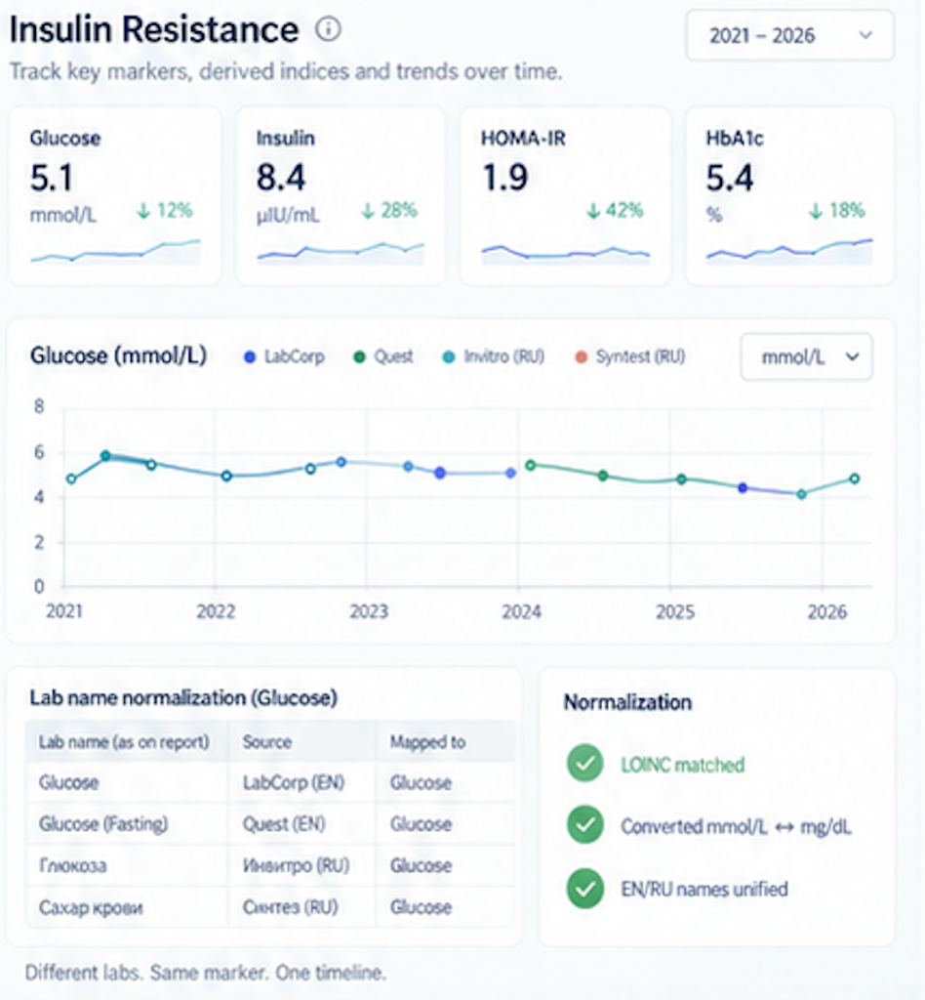

# Add panel detail results table, analyte trends chart with lab history, report-specific ranges, and raw mapping audit

> **Status (2026-09-11): in progress.** Part of section 1 shipped 2026-09-10:
> Panel Detail's and All Observations' Results tabs render observations and
> indices as one table, the indices under an "Indices" divider row. Not built:
> the lab and pricing toggles, the jump from a row to Trends, the Trends tab
> itself (still a placeholder), and the select/deselect-all buttons.

Each monitoring panel detail view organizes analytical and audit tools into a clear four-tab progression:

1. **Results** (Table): Chronological observations and indices with filters, lab metadata, and pricing.
2. **Trends** (Specific Marker): Single-analyte focus view with unit switcher, multi-lab comparison, report-specific reference ranges, and the raw mapping audit table ("Table of Matches").
3. **What's in range**: Multi-marker 2D normalized overlay time-chart across all panel markers (as currently implemented).
4. **Charts**: Multi-marker 3D stacked visualization of all markers across the panel over time (as currently implemented).

---

## 1. Results Tab (Panel Results Table)

- Display the structured results table for all observations and indices belonging to the panel across chronological sampling visits.
- Support standard table controls (sample count limits, unit system switching, lab and pricing toggles).
- Quick selection of an analyte to jump directly to its detailed **Trends** view.

---

## 2. Trends Tab (Analyte Focus)

The **Trends** tab focuses on individual marker trajectory and data provenance:

### 2.1 Key Marker Summary Cards (Top)
- Carousel / row of summary cards for the panel's primary markers (e.g. Glucose, Insulin, HOMA-IR, HbA1c).
- Each card shows:
  - Current value & unit
  - Directional delta & percentage change (e.g. `↓ 12%`, `↑ 18%`)
  - Mini sparkline over time
- Clicking any card switches the main trend chart and audit table below to that analyte.

### 2.2 Interactive Analyte Timeline Chart (Middle)
- **Title & Unit Switcher**: e.g. `Glucose (mmol/L)` with a unit selector dropdown (`mmol/L`, `mg/dL`).
- **Multi-Lab Legend**: Color-coded points and line segments by performing laboratory (e.g. LabCorp, Quest, Invitro, Syntest).
- **Date Range Selector**: Dropdown or slider (e.g. `2021 – 2026`).
- **Tooltip / Hint**:
  - Draw date & performing lab
  - Analytical method (e.g. ECLIA, Hexokinase)
  - Specimen type (e.g. Serum, Plasma)
  - Raw reported value & units vs. normalized value & units
  - Report-specific reference range for that draw date
- **Reference Range Bands**: Shaded area or step-lines showing report-specific reference ranges.

### 2.3 Lab Name Normalization & Audit ("Table of Matches", Bottom)
- **Mapping Table**:
  - `Lab name (as on report)`
  - `Source` (Lab & language/locale, e.g. `LabCorp (EN)`, `Invitro (RU)`)
  - `Mapped to` (Canonical display name & LOINC)
  - Method, Specimen, raw value/unit, report range
- **Normalization Badges**:
  - Checkmarks highlighting applied normalizations:
    - *LOINC matched*
    - *Converted units (e.g. mmol/L ↔ mg/dL)*
    - *Multilingual names unified (e.g. EN/RU)*
- Tagline: *"Different labs. Same marker. One timeline."*

Provide full transparency on how raw printed lab data was ingested, matched, and transformed into canonical form:

| Source Report (As Printed) | Mapped & Normalized (Canonical) |
| --- | --- |
| **Date** (sampling date) | **Canonical LOINC** |
| **Lab** (originating facility) | **Canonical Display Name** |
| **Method** (analytical methodology) | **Normalized Value** |
| **Specimen** (sample matrix) | **Normalized Unit** |
| **Raw LOINC** (if printed on report) | **Canonical Reference Range** |
| **Raw Test Name** | |
| **Raw Value** | |
| **Raw Unit** | |
| **Report Reference Range** | |

- Highlights mapping confidence or discrepancies (e.g., derived LOINCs, alias matches).
- Allows auditing exact transcription against canonical storage.

---

## 3. "What's in range" Tab

- Retains current 2D multi-marker normalized overlay timeline across all panel analytes.
- Provides immediate visual grasp of which markers in the panel fall inside vs. outside reference intervals across visits.
- **"Select / Deselect all" Button**: Quick global toggle allowing the user to select or deselect all panel markers at once with a single click.

---

## 4. "Charts" Tab (3D Panel Chart)

- Retains current 3D canvas engine rendering all markers in the panel simultaneously along stacked depth planes over time.
- **"Select / Deselect all" Button**: Quick action in the biomarker picker allowing bulk toggle of markers up to the display limit.
