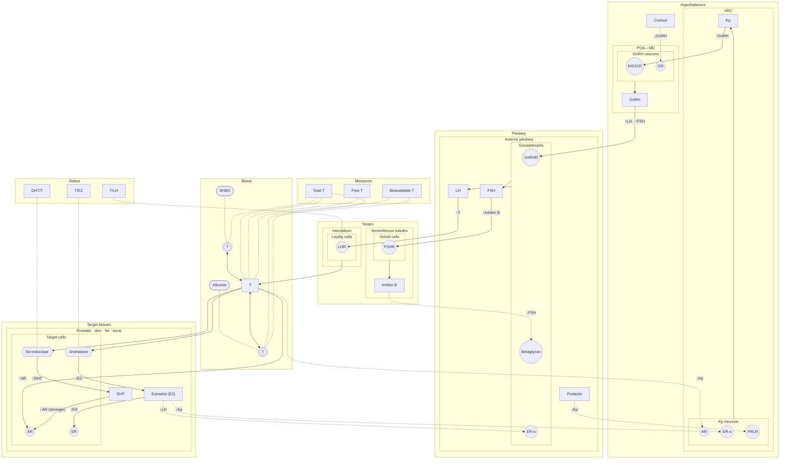

# Add a Hormonal Pathways section, starting with the gonadal axis

Monitoring Panels and All Observations show each marker on its own: a row in
Results, a line in "What's in range", a ribbon in Charts. None of them shows
how the hormones of one axis drive and restrain each other. This task adds a
**Hormonal Pathways** section: one data-driven diagram per hormonal axis, with
the user's own values for a chosen month, so a low testosterone can
be read next to the LH that should be driving it and the estradiol and SHBG
around it. Its first axis, and the only one in this delivery, is the male
hypothalamic–pituitary–gonadal (HPG) axis.

The layout started from ChatGPT design mockups: one Alex shared on 2026-09-11,
and a revised one, produced from an image prompt drafted in chat the same day
and reviewed the same day too. They are a **visual style reference only** —
never a source for edges or biology; both had wiring errors (see
[Biology corrections](#41-biology-corrections-vs-the-mockups)). No image is
saved to the repo; this file and the Mermaid wiring spec
`docs/tech/pathways/hpg.md` ([3](#3-implementation-approach)) are the spec.

---

## 1. Where it lives

- A new section, **Hormonal Pathways**, with its own left-nav item placed
  right after Monitoring Panels: `NAV_ITEMS` (`routing.ts`) grows from eight
  to nine (`view: 'pathways'`), with a `lucide-react` line icon in `SideNav`
  like the others. The phone `NavBar` gains the label too; its shell is still
  task-0020's.
- **Blocked while diagnostic reports have validation errors**, exactly like
  Monitoring Panels and All Observations: `isNavItemBlocked` covers
  `'pathways'`, and the route redirects to `#reports` while errors exist.
- **Routes**: `#pathways` defaults to `#pathways/hpg`; one segment per axis
  (`hpg`, later `hpt`, `hpa`); an unknown segment falls back to `hpg`.
  `isNavItemActive` holds for every `#pathways/<axis>`. Switching axis tabs
  pushes history the way All Observations' tabs do.
- The landing page opens with the same **`PageHeader`** banner as every other
  section, its description line **Biochemical pathways of hormones**.
- **Axis tabs** in a `TabBar` under the banner:
  - **Gonadal (HPG)** — this task, everything specified below.
  - **Thyroid (HPT)** and **Adrenal (HPA)** — later phases, not in this
    delivery. A tab is added when its axis is built; until then
    `#pathways/hpt` and `#pathways/hpa` fall back to `hpg` like any unknown
    segment.
- **The ‹ month › stepper is shared across axes** ([5](#5-month-selection)).
- **Crosstalk edges** (e.g. PRL → ↓Kp, Cortisol → ↓GnRH) render on every axis
  they touch. Until the other axis exists, they are drawn as side inputs.
- **Entry is the nav item only.** No link from Monitoring Panels or Panel
  Detail, and no links between the Reference Book and this section
  ([10](#10-out-of-scope)).
- **Men only** for now. The female axis (ovary, cycle-dependent feedback) is
  a later task. The section never refuses to render over sex (Database
  details' `sex`):
  - sex unset → the male axis, with a visible note **"Assumes male — set sex
    in Database details"**;
  - sex female → the male axis, with the same note plus **"women's axis not
    available yet"**;
  - sex-dependent bands (`biot`) follow `bandsBySex` as they do elsewhere in
    the app.
- The section's view is a `React.lazy` call-site import behind a `<Suspense>`,
  like Panel Detail's "What's in range" and "Charts" tabs, so the diagram code
  loads on first visit.
- The Reference Book's **HP Axis** (`#reference/hp-axis`) and **Testosterone**
  (`#reference/testosterone`) pages remain the explanatory text; Hormonal
  Pathways is the data-driven view. The diagram does not restate prose that
  contradicts the Testosterone page; if the view needs a fact that page lacks,
  the page gains it first.

---

## 2. Ontology

Decided 2026-09-11. Node kinds describe **roles in the pathway, not
chemistry**: a steroid and a peptide hormone are both signals. Chemical class
(steroid, peptide, glycoprotein, protein) appears only as text in a node's
hover card. A molecule can play several roles — testosterone is a signal and
the substrate of two conversions — and the relation is carried by the line,
never by a second node kind.

### 2.1 Sites

A site is a place in a four-level hierarchy, **organ → region/tissue → cell →
receptor**, the same hierarchy the HP-axis `(site · subsite)` notation names:

| Organ (band) | Region / tissue | Cell | Receptors |
| --- | --- | --- | --- |
| Hypothalamus | ARC | Kp neurons | AR, ER-α, PRLR |
| Hypothalamus | POA—ME | GnRH neurons | KISS1R, GR |
| Pituitary | Anterior pituitary | Gonadotrophs | GnRHR, ER-α, Betaglycan |
| Testes (gonads) | Interstitium | Leydig cells | LHR |
| Testes (gonads) | Seminiferous tubules | Sertoli cells | FSHR |
| Target tissues | Prostate · skin · fat · bone | Target cells | AR, ER |

- **Drawing**: an organ is a **band**; a region is a **small label** in its
  band; a cell is a **large shape**; a receptor is a **small dot on the cell's
  edge**, where an arrow lands.
- **Receptors are the deepest site level**, not a separate node kind. Every
  signaling and feedback arrow lands on one, and every receptor has at least
  one arrow landing on it. Alex's examples named GnRHR, LHR, FSHR, AR, ER and
  ER-α; PRLR, KISS1R, GR, betaglycan (the inhibin B co-receptor) and the
  gonadotrophs' ER-α are added so that every arrow has a receptor to land on.
- **The GnRH neurons carry no AR or ER-α dot** (decided 2026-09-11): they
  largely lack both receptors, so the hypothalamic sex-steroid feedback lands
  on the Kp neurons' AR and ER-α instead. That evidence is largely rodent; it
  is to be verified against a retrieved citation when
  `pathways-sources.json` is built ([4.0](#40-edges)).
- **Blood** is a band with no regions or cells: a compartment, not an organ
  site. It holds the circulating testosterone and its carriers.
- Some signals come from outside the drawn sites and have no secretion arrow:
  **Cortisol** (adrenal, a side input from the HPA axis), **Prolactin**
  (lactotrophs, not drawn) and the carriers **SHBG** and **Albumin** (liver).
  Each hover card names its source.

### 2.2 Signals

**One kind** for every messenger molecule on the axis: T, E2, DHT, Cortisol,
GnRH, Kp, LH, FSH, Prolactin, Inhibin B. A signal is secreted by a cell
(secretion arrow), made by a conversion, or enters as a side input, and it
acts by landing on a receptor (signaling or feedback arrow).

- The **central T** bubble, in the Blood band, is the free pool. It is
  labelled just **"T"** and shows **no amount**; the Free T measure badge
  carries its value ([2.5](#25-badges)).
- **Docked T** bubbles — small "T" bubbles attached to a carrier, one on SHBG
  and one on Albumin — are the same molecule held by that carrier. Each shows
  **"T" plus its calculated amount** (SHBG-bound T, Albumin-bound T) with the
  calculated provenance icon ([2.8](#28-icons); decided 2026-09-11, BM2). Each docked T
  exchanges (⇄) with the central T.

### 2.3 Carriers

**SHBG** and **Albumin**: medium bubbles, each showing its measured value.
Testosterone is drawn **docked** on them, which replaces the old "binds" label
and cannot be read as "SHBG produces SHBG-bound T". A carrier has no pathway
arrow of its own: its only lines are the docking association to its docked T.
**"More SHBG → less free T" is implied by docking and the ⇄ exchange, not
drawn** (decided 2026-09-11): there is no SHBG → ↓Free T arrow, and the SHBG
hover card states the effect.

### 2.4 Enzymes

**Aromatase** and **5α-reductase**: small nodes **on the conversion path**
(Free T → enzyme → product), located inside their cells — aromatase in fat,
brain and the Leydig cells, 5α-reductase in prostate and skin — so a ratio
badge can link to the enzyme it indexes. They carry no value. Their locations
are hover-card text; in the drawing both sit in the Target cells.

### 2.5 Badges

Descriptive readouts on the **right-hand side**, in two headed groups:

| Group | Badge | Links to (association line) |
| --- | --- | --- |
| **Measures** (pools) | Total T | its three pools: the central T and both docked T ("part of") |
| | Free T | the central T ("part of") |
| | Bioavailable T | the central T and the Albumin docked T ("part of") |
| **Ratios** (processes) | T/LH | the Leydig cells — T response per unit of LH |
| | DHT/T | 5α-reductase — the share of T converted to DHT |
| | T/E2 | aromatase — low = more aromatization |

- **Badge face**: value, unit, status dot, provenance icon.
- **Badge text is single-sourced where an index exists** (decided 2026-09-11):
  Free T and Bioavailable T reuse the `cft` and `biot` text and citations in
  `INDEX_DEFS`, as the three ratio badges reuse `tlh`, `dhtt` and `te2`. A
  badge may show a shorter summary derived from that text, but the source
  stays `INDEX_DEFS`; only Total T, which has no index, has its explanation
  written into the sidecar ([3](#3-implementation-approach)).
- **Ratios are not chips on arrows any more**: no arrow carries a ratio, and
  no arrow's thickness follows one ([7.2](#72-pathway-thickness)).
- **FAI is left out** for now ([10](#10-out-of-scope)): a unitless index
  (T/SHBG × 100) validated in women and poor in men. It is added with the
  women's axis, as a ratio-like badge linked to SHBG and Total T.

### 2.6 Lines

| Line | Drawn as | Kinds |
| --- | --- | --- |
| **Association** | faint, no arrowhead, no thickness encoding, no ↑/↓ | **part of** (measure badge → the pools it sums); **ratio link** (ratio badge → cell or enzyme); **docking** (carrier ↔ its docked T) |
| **Pathway arrow** | directional, thickness by its **source's** value ([7.2](#72-pathway-thickness)), ↑/↓ on the target | **secretion** (cell → signal, unmarked); **conversion** (signal → enzyme → signal, marked ↑DHT / ↑E2); **signaling** and **feedback** (signal → receptor, marked ↑B / ↓B, feedback and crosstalk dashed); **exchange** (⇄, central T ↔ docked T, unmarked) |

### 2.7 Values

- A value is a **number + unit following the app's SI/US switch** — e.g. SHBG
  in nmol/L, Albumin in g/dL.
- **Provenance icon** beside every value: **measured** (flask),
  **calculated** (calculator), **not measured** (dashed circle, beside a grey
  "–" value). It replaces the earlier "calculated" tag.

### 2.8 Icons

Decided 2026-09-11. A **custom icon set, one icon per role**, drawn by us as
SVG in the line style of the woven-knot logo
(`web/public/brand/paneloom-mark.svg`): a **24px grid, 2px stroke, round caps,
a single navy, no fills** — the carriers alone add a filled version. Each icon
is concept-sketched first in ChatGPT and then redrawn by hand; stock and
AI-generated images are inspiration only, never shipped or traced.

| Role | Icon |
| --- | --- |
| Signal | a small hub with three branches, each ending in a circle — the same icon for every hormone, steroid or peptide |
| Carrier | one family for both: a **ball of one thick woven thread**, echoing the woven-knot logo, with steroid molecules docked in its gaps (ChatGPT concept 1, "Knitted / Woven", chosen 2026-09-11). **SHBG** holds **one** steroid deep inside a gap; **Albumin** holds **two or three** sitting loosely at its edge. The "SHBG" / "Albumin" label carries the name; SHBG being a homodimer is hover text, not silhouette |
| Enzyme | a **closed ring of interlocked links** — a hexagonal chain echoing the woven-knot logo — in one navy line, with no outward stubs; not a C-shaped pocket |
| Tissue / region | a circle "looking into" tissue: four or five rounded, irregular cells, each with a nucleus dot — never regular hexagons, which would clash with the enzyme ring. It also stands for a cell: there is **no separate cell icon** |
| Receptor | a Y-shaped receptor spanning a membrane arc drawn as a double line (the bilayer) |
| Provenance | a flask = measured; a calculator = calculated; a dashed circle = not measured ([2.7](#27-values)) |

- **Carrier versions**: a flat version — navy outline, teal fill, amber
  steroids — for diagram nodes (40–64px); a 24px line version; and a soft 3D
  rendering for hover cards and the Reference Book.
- **Steroids**, wherever drawn in detail, are angular fused rings — three
  hexagons and one pentagon — never a straight chain of hexagons.
- The two **badge groups get no icons** — only their headings, "Measures" and
  "Ratios".
- **No banner illustration** for now: the section's `PageHeader` carries text
  and pillars only.

---

## 3. Implementation approach

- **Wiring source of truth: Alex's HP-axis notation** — the cascade notation
  of his homepage health/labs notes, carried today by the Reference Book HP
  Axis page (`HpAxisPage` in `ReferenceBookPage.tsx`, rendering the verbatim v2
  HTML in `hpAxisContent.ts`): signals, `(site · subsite)` targets,
  `{process}` conversions, ↑/↓ per edge, ⟲ closing a loop, and crosstalk.
- **The wiring spec is Mermaid** (decided 2026-09-11, BC1, revising the
  earlier hand-written-JSON plan): **one Markdown file per axis**,
  `docs/tech/pathways/<axis>.md` (`hpg.md` now; `hpt.md` and `hpa.md` for the
  HP Axis page's other chains), each holding a single ` ```mermaid ` flowchart
  fence. Markdown, so GitHub and VS Code's preview render it; to view it, open
  it on GitHub, install VS Code's **Markdown Preview Mermaid Support**
  extension, or paste the fence into mermaid.live. Only a **restricted
  subset** of flowchart syntax is allowed, and it encodes the ontology of
  [2](#2-ontology) — subgraph nesting gives the site level, node shape the
  node kind:

  | Mermaid | Means |
  | --- | --- |
  | `flowchart TB` | the fence's first line |
  | top-level `subgraph ID["Label"]` … `end` | a band: an organ site, or the Blood compartment; band order = subgraph order, top to bottom |
  | top-level `subgraph MEASURES["Measures"]`, `subgraph RATIOS["Ratios"]` | the two badge groups, drawn on the right in that order; these two ids are reserved |
  | `subgraph` nested in a band | a region, drawn as a small label |
  | `subgraph` nested in a region | a cell, drawn as a large shape; nesting deeper fails |
  | `ID["Label"]` in a band or region | a signal |
  | `ID["Label"]` in a badge group | a badge: a measure in MEASURES, a ratio in RATIOS |
  | `ID(["Label"])` in a band or region | a carrier |
  | `ID((("Label")))` in a band or region | a docked signal |
  | `ID(("Label"))` in a cell | a receptor |
  | `ID{{"Label"}}` in a cell | an enzyme |
  | `CELL --> S` | secretion: a cell's subgraph id → a signal, unlabelled |
  | `S -->\|"↑B"\| R` | signaling: a signal → a receptor, solid |
  | `S -.->\|"↓B"\| R` | feedback, or crosstalk where the sidecar says so: a signal → a receptor, dashed |
  | `S --> E -->\|"↑P"\| P` | conversion: substrate signal → enzyme → product signal, on one line — the only chain allowed, and only through an enzyme |
  | `S <--> D` | exchange (⇄): a signal and its docked form, unlabelled |
  | `A -.- B` | association, unlabelled, its kind given by its endpoints: measure badge → signal or docked signal = part of; ratio badge → cell or enzyme = ratio link; carrier → docked signal = docking |

  Every label is quoted. A signaling, feedback or conversion label is one or
  more `·`-separated effects, each **↑B** or **↓B**, optionally ending in a
  parenthetical qualifier: `"↑LH · ↑FSH"`, `"↑AR (stronger)"`. **B** is the
  signal the target receptor's cell then secretes (`LH -->|"↑T"| LEY_LHR`) —
  or, at a target cell's receptor, which secretes nothing on this axis, the
  receptor's own activation (`↑AR`, `↑ER`); on a conversion it is the product
  (`↑DHT`, `↑E2`). The site an arrow acts at is never written in a label: it
  is the target receptor's position in the subgraph tree. Anything outside the
  subset — another arrow form, an unquoted or multi-line label, a labelled
  secretion, exchange or association, an unlabelled signaling edge, a shape
  outside the place it is allowed, an edge whose endpoints are not the kinds
  its form takes, a chain not through an enzyme, `classDef`/`style`, `A & B`
  chains, a node declared outside a subgraph — fails the build rather than
  being ignored.
- **A script generates the data**: `npm run pathways:build`
  (`web/scripts/build-pathways.mjs`) parses that subset into
  `web/public/data/pathways.json` — generated, never hand-edited, the way
  `npm run schema:types` generates `envelopeTypes.ts` from the schema.
  `pathways.json` sits beside `analyses.json`, is described by a closed-object,
  draft 2020-12 schema, `web/public/schema/pathways-1.schema.json`, and is
  validated in `web/test/reference-data.test.ts` — ADR-0010's rule that
  reference data lives in JSON and is never mirrored in TypeScript. A **drift
  test** regenerates it from the Markdown and fails CI if the committed JSON
  differs.
- **What Mermaid cannot say lives in a hand-edited sidecar**,
  `web/public/data/pathways-sources.json`, which the build merges into
  `pathways.json`. Its keys are the Mermaid ids:
  - **Sites** (band, region and cell subgraph ids) and **receptors**: the
    hover card's description — e.g. the receptor's full name (LHR: the LH/choriogonadotropin receptor, LHCGR).
  - **Signals and carriers**: a LOINC (analytes) or an index key, or, with
    neither (GnRH, Kp), what it is; its chemical class; its source where no
    secretion arrow draws one (Cortisol, Prolactin, SHBG, Albumin).
  - **Docked signals**: what they are (SHBG-bound T, Albumin-bound T) and
    their calculation ([4.2](#42-blood-transport)). The central T (`FT`) maps
    to the free pool, whose value the Free T badge shows.
  - **Enzymes**: chemical class and `locatedIn` — aromatase: fat, brain,
    Leydig cells; 5α-reductase: prostate, skin.
  - **Total T** (the one measure badge with no index): its LOINC, plus the
    **expanded explanation** a click shows ([8](#8-interaction)) —
    physiological meaning, what low means, what high means, caveats — **with
    citations**.
  - **Index badges** — the measures Free T and Bioavailable T and the three
    ratios: the index key only (`cft`, `biot`; `tlh`, `dhtt`, `te2`). Their
    explanation is the existing `INDEX_DEFS` prose and references in
    `web/src/data/indexDefs.ts` — a single source of truth shared with the
    Reference Book — and the sidecar carries no prose for them (decided
    2026-09-11); a shorter badge summary may be derived from that text.
  - **Pathway arrows and docking lines**: keyed `"SRC->DST"`, a conversion
    `"SRC->ENZYME->DST"`, each with its citation — retrieved quote, URL and
    retrieval date, in the style of `indexDefs.ts`'s references and
    `molar-masses.json`'s sources — and a `crosstalk` flag on the dashed
    arrows that are crosstalk rather than feedback (PRL → ↓Kp,
    Cortisol → ↓GnRH). Part-of lines and ratio links carry no citation of
    their own: they cite through their badge.

  A completeness test fails if any node or subgraph id is unmapped, any
  pathway arrow or docking line lacks a citation, an index badge carries
  prose, or any sidecar key names a node, subgraph or edge the Markdown lacks.
- **Every edge in `pathways.json`** carries source, target, its line
  (association or pathway arrow) and kind (part of, ratio link, docking;
  secretion, conversion, signaling, feedback, crosstalk, exchange), its
  enzyme on a conversion, its mark (↑ or ↓ with B, on signaling, feedback,
  crosstalk and conversion only), its dashed flag, the site it acts at (the
  target receptor's band · region · cell, derived at build time) and, from the
  sidecar, its citation.
- The Markdown files carry **every chain the HP Axis page shows today** —
  HPT, HPG, HPA and their crosstalk — so its migration drops nothing, even
  though only the HPG diagram is built now.
- **Both consumers read the generated `pathways.json`**, so they cannot drift:
  - the Reference Book HP Axis page — its cascade chains, now hand-written
    inside `HP_AXIS_HTML`, are migrated to render from `pathways.json` (the
    notation key and the surrounding prose may stay as they are): a signaling
    edge's target receptor renders as its `(site · subsite)`, a conversion as
    `{process·location}`, so `(Testes)↑T` and `{aromatization·fat}↑E2` read as
    today ([11](#11-open-questions));
  - the Hormonal Pathways diagram.
- **Layout**: an SVG drawn in code with hand-set coordinates per node per
  axis (in the sidecar or a small layout file — never in the generated
  `pathways.json` — [11](#11-open-questions)), styled with the design tokens
  (`COLOR`); values, status colors and line thicknesses are applied from the
  user's data for the selected month. Not a generated image; Mermaid's own
  layout is never used.
- **Mermaid rendering was considered (2026-09-11) and rejected**, and that
  stands: Mermaid is the authoring notation only, never bundled or rendered in
  the app — neither the diagram nor the Reference Book. Its auto-layout cannot
  hold the banded layout, it has no animated transitions, per-edge styling and
  interaction are awkward, and it costs ~500 kB of bundle. Rendering is
  hand-laid SVG only.
- The mockups set visual style only; the edges below come from the notation.

### 3.1 HPG spec

The content of `docs/tech/pathways/hpg.md` (Alex's, 2026-09-11, rewritten the
same day for the ontology of [2](#2-ontology), and T's hypothalamic feedback
moved onto the Kp neurons the same day). This block is the **source of
truth** for the HPG wiring: the prose below describes exactly what it encodes,
and where the two ever disagree, the block wins. It renders at mermaid.live
(checked against Mermaid 11: 19 subgraphs, 34 nodes, 36 edges).



Rewritten 2026-09-11 for the ontology, the block winning:

- The feedback and crosstalk arrows and their ↑/↓ marks are kept; each now
  lands on a receptor (Free T → AR on the Kp neurons, E2 → ER-α on the Kp
  neurons and on the gonadotrophs, PRL → PRLR, Inhibin B → betaglycan,
  Cortisol → GR).
- **T's hypothalamic feedback lands on the Kp neurons**: the Free T → AR arrow
  onto the GnRH neurons, marked ↓GnRH, is now `FT -.->|"↓Kp"| KPN_AR`, and
  the GnRH neurons lose their AR dot ([2.1](#21-sites)).
- Forward drive now runs signal → receptor, marked with what that cell then
  secretes (LH → LHR marked ↑T), then cell → signal by an unmarked secretion
  arrow. GnRH's two old arrows are one arrow onto GnRHR marked `"↑LH · ↑FSH"`,
  followed by the gonadotrophs' two secretion arrows. LH and FSH no longer end
  unmarked at a cell.
- The central T (`FT`, label "T") replaces the "Free T" node; the docked T
  nodes (`SBT`, `ABT`, label "T") replace "SHBG-bound T" and "Albumin-bound T";
  docking replaces "binds".
- The two enzymes are nodes on the conversion paths, and the conversions now
  carry their product's mark (↑DHT, ↑E2).
- Total T and Bioavailable T are no longer nodes in the Blood band but measure
  badges, with a new Free T measure badge beside them; their `part of` lines
  are associations from the badge to its pools.
- T/LH, DHT/T and T/E2 are ratio badges linked to the Leydig cells,
  5α-reductase and aromatase, no longer chips on arrows.
- **SHBG → ↓Free T is dropped, and stays dropped** (decided 2026-09-11). No
  line kind of [2.6](#26-lines) is a carrier → signal arrow; "more SHBG → less
  free T" is implied by the docking line and the ⇄ exchange, not drawn, and
  the SHBG hover card states it.
- Cortisol stays declared in the Hypothalamus band, at band level, and is
  drawn at its edge as a side input (a layout matter, not wiring).

---

## 4. Gonadal axis (HPG)

Horizontal bands, one per level of the axis, top to bottom, with the badge
groups on the right:

| Band | Contents | Notes |
| --- | --- | --- |
| Hypothalamus | Region ARC: Kp, and the Kp neurons (AR, ER-α, PRLR). Region POA—ME: GnRH, and the GnRH neurons (KISS1R, GR). Cortisol, at band level, drawn at the band's edge as a side input | Kp neurons secrete Kp; Kp → KISS1R marked ↑GnRH; GnRH neurons secrete GnRH. Neither Kp nor GnRH is measured in practice ([6](#6-missing-data)). Cortisol → GR on the GnRH neurons, marked ↓GnRH, enters from the band's edge (see [4.1.1](#411-hypothalamus-and-pituitary-wiring)). |
| Pituitary | Region Anterior pituitary: LH, FSH, Prolactin, and the gonadotrophs (GnRHR, ER-α, Betaglycan) | GnRH → GnRHR marked ↑LH · ↑FSH; the gonadotrophs secrete LH and FSH. Prolactin is a pituitary hormone and its bubble sits in this band; it brakes the axis at the hypothalamus, PRL → PRLR on the Kp neurons, marked ↓Kp. |
| Testes | Region Interstitium: the Leydig cells (LHR). Region Seminiferous tubules: Inhibin B, and the Sertoli cells (FSHR) | LH → LHR marked ↑T; the Leydig cells' one secretion arrow runs down to the central T in the Blood band ([4.2](#42-blood-transport)). FSH → FSHR marked ↑Inhibin B; the Sertoli cells secrete Inhibin B. A small note: the testes also secrete some E2 and DHT directly, but most of both comes from peripheral conversion (Target tissues band). A text-only note: inside the testes the Sertoli cells' androgen-binding protein (ABP, the same gene as SHBG) holds testosterone locally — no ABP node. |
| Blood | the central T; SHBG and Albumin carriers, each with its docked T | Docked T ⇄ central T on both sides. See [4.2](#42-blood-transport). |
| Target tissues | Region Prostate · skin · fat · bone: DHT, E2, and the target cells (5α-reductase, aromatase, AR, ER) | T → AR marked ↑AR; T → 5α-reductase → DHT (↑DHT), DHT → AR marked ↑AR (stronger); T → aromatase → E2 (↑E2), E2 → ER marked ↑ER. See [4.3](#43-target-tissues). |
| Badges (right) | Measures: Total T, Free T, Bioavailable T. Ratios: T/LH, DHT/T, T/E2 | Association lines only ([2.5](#25-badges)). |

Feedback: Free T → AR on the Kp neurons (↓Kp) ⟲; E2 → ER-α on the Kp
neurons (↓Kp) ⟲; E2 → ER-α on the gonadotrophs (↓LH) ⟲; Inhibin B →
betaglycan on the gonadotrophs (↓FSH) ⟲ — four arrows ([4.0](#40-edges)),
dashed like the two crosstalk arrows, so visually distinct from the solid
forward drive.

Region labels (ARC, POA—ME, …) appear where the band has room.

DHEA-S and ferritin are **not shown at all** — no nodes, no "Related" strip.

### 4.0 Edges

The full HPG edge set, mirroring the HP Axis page's chains
(`↑PRL → (Hypothalamus·ARC)↓Kp → (Hypothalamus·POA—ME)↓GnRH → (Pituitary)↓LH/FSH → (Testes)↓T`,
`↑T → {aromatization·fat}↑E2 → (Hypothalamus·ARC)↓Kp → … ⟲`,
`↑Cortisol → (Hypothalamus·POA)↓GnRH → …`) plus the secretion, transport,
tissue and badge lines the diagram adds, and the three feedback arrows the
page's chains do not carry — Free T → ↓Kp, E2 → ↓LH and Inhibin B → ↓FSH.
Every row below is one line of the [3.1](#31-hpg-spec) block.

**Flag — HP Axis page consistency.** The page's HPG chain closes T's loop only
through `{aromatization·fat}↑E2 → (Hypothalamus·ARC)↓Kp`. Because both
consumers read `pathways.json` ([3](#3-implementation-approach)), migrating the
page will very likely add the Free T → ↓Kp arrow (and E2 → ↓LH) to its
chain; whether the page shows them, and in what form, is settled at migration,
and the migration test ([12](#12-verification-plan)) changes with it.

**Pathway arrows**

| Arrow | Kind | Acts at | Notes |
| --- | --- | --- | --- |
| Kp neurons → Kp | secretion | — | unmarked |
| Kp → KISS1R, ↑GnRH | signaling | Hypothalamus · POA—ME · GnRH neurons | |
| GnRH neurons → GnRH | secretion | — | |
| GnRH → GnRHR, ↑LH · ↑FSH | signaling | Pituitary · Anterior pituitary · Gonadotrophs | one arrow, two effects |
| Gonadotrophs → LH, Gonadotrophs → FSH | secretion | — | |
| LH → LHR, ↑T | signaling | Testes · Interstitium · Leydig cells | |
| Leydig cells → T | secretion | — | the Leydig cells' only outgoing arrow; lands on the central T |
| FSH → FSHR, ↑Inhibin B | signaling | Testes · Seminiferous tubules · Sertoli cells | |
| Sertoli cells → Inhibin B | secretion | — | the only arrow into Inhibin B |
| SHBG's docked T ⇄ T, T ⇄ Albumin's docked T | exchange | Blood | unmarked, two-way |
| T → AR, ↑AR | signaling | Target tissues · Target cells | |
| T → 5α-reductase → DHT, ↑DHT | conversion | `{5α-reduction}` | DHT/T badge links to the enzyme |
| DHT → AR, ↑AR (stronger) | signaling | Target tissues · Target cells | |
| T → aromatase → E2, ↑E2 | conversion | `{aromatization}` | T/E2 badge links to the enzyme |
| E2 → ER, ↑ER | signaling | Target tissues · Target cells | |
| T → AR on the Kp neurons, ↓Kp ⟲ | feedback (dashed) | Hypothalamus · ARC · Kp neurons | leaves the central T, the free fraction that enters cells; needs no aromatization at the hypothalamus; lowers GnRH through Kp, since GnRH neurons largely lack AR and ER-α (largely rodent evidence, to verify) |
| E2 → ER-α on the Kp neurons, ↓Kp ⟲ | feedback (dashed) | Hypothalamus · ARC · Kp neurons | lowers GnRH through Kp |
| E2 → ER-α on the gonadotrophs, ↓LH ⟲ | feedback (dashed) | Pituitary · Anterior pituitary · Gonadotrophs | T's pituitary effect needs aromatization, so it is drawn from E2, not T |
| Inhibin B → betaglycan, ↓FSH ⟲ | feedback (dashed) | Pituitary · Anterior pituitary · Gonadotrophs | the main FSH brake |
| PRL → PRLR, ↓Kp | crosstalk (dashed) | Hypothalamus · ARC · Kp neurons | |
| Cortisol → GR, ↓GnRH | crosstalk (dashed) | Hypothalamus · POA—ME · GnRH neurons | side input from the adrenal (HPA) axis |

**Association lines**

| Line | Kind |
| --- | --- |
| SHBG — its docked T, Albumin — its docked T | docking |
| Total T — SHBG's docked T, T, Albumin's docked T | part of |
| Free T — T | part of |
| Bioavailable T — T, Albumin's docked T | part of |
| T/LH — Leydig cells | ratio link |
| DHT/T — 5α-reductase | ratio link |
| T/E2 — aromatase | ratio link |

There is **no direct PRL → GnRH arrow**, no PRL → LH or FSH arrow, no FSH →
Inhibin B arrow (FSH acts through the Sertoli cells), no direct T → LH arrow
(T's pituitary effect is drawn as E2 → ↓LH), no T → FSH or E2 → FSH arrow (both
contribute to the FSH brake far less than inhibin B), no pathway arrow from or
to SHBG or Albumin, no arrow out of the Leydig cells but the one secretion into
T, and no line into or out of a badge but its associations.

**Feedback citations** (decided 2026-09-11, AZ1). Each of the four feedback
arrows carries its own retrieved citation in `pathways-sources.json`, like
every pathway arrow.
For Free T → ↓Kp and E2 → ↓LH — that T's hypothalamic feedback does not require
aromatization while its pituitary effect does — the expected source is
Pitteloud et al., *J Clin Endocrinol Metab*, ~2008; it is to be retrieved and
its claim verified against the text, not assumed from this note. Free T →
↓Kp's landing site also needs its own retrieved citation: that GnRH neurons
largely lack AR and ER-α and that androgen feedback acts through the Kp
(KNDy) neurons rests largely on rodent work, and is verified when
`pathways-sources.json` is built rather than assumed from this note. No measured
edge strength exists, so no feedback arrow is weighted by an estimated share
of the brake: all four are drawn alike, their thickness following their
source, as every arrow's does ([7.2](#72-pathway-thickness)).

### Edge notation

The HP Axis page's ([3](#3-implementation-approach)), in the line kinds of
[2.6](#26-lines):

- **Pathway arrows** are plain **→**, "acts on / travels to", solid for
  forward drive and dashed for feedback and crosstalk. On a signaling,
  feedback or crosstalk arrow the effect is written as **↑** or **↓**
  immediately before a signal, next to the target, and belongs to that
  signal: **GnRH → ↑LH** means when GnRH rises, LH rises (stimulates);
  **PRL → ↓Kp** means when prolactin rises, kisspeptin falls (suppresses).
  The arrow lands on the receptor dot of the cell that secretes that signal.
  An arrow onto a target cell's receptor carries the receptor's activation —
  T → ↑AR, DHT → ↑AR (stronger), E2 → ↑ER. A conversion runs through its
  enzyme node and carries its product's mark, ↑DHT or ↑E2. A secretion arrow
  (cell → signal) and the ⇄ exchange carry no mark.
- **Association lines** are faint, with **no arrowhead**, no mark and no
  thickness: docking (a carrier holding its docked T — it never reads as
  production), part of (a measure badge to the pools it sums) and ratio links
  (a ratio badge to the cell or enzyme whose process it indexes).

There is no ⊣, no flat bar end and no red inhibitory line anywhere in the
view. One deliberate difference from the HP Axis page: that page tints its
↑/↓ in the accent color, while this view leaves them uncolored.

Beside the diagram, a **How to read this** legend:

- **Bands** are organs (Hypothalamus, Pituitary, Testes, Target tissues) plus
  Blood; a small label names a region; a large shape is a cell; a dot on a
  cell's edge is a receptor, where an arrow lands.
- **→** acts on; a dashed arrow is feedback or crosstalk.
- **↑B**: B rises when the source rises — e.g. GnRH → ↑LH.
- **↓B**: B falls when the source rises — e.g. PRL → ↓Kp.
- An arrow onto a target cell's receptor is marked with its activation (↑AR,
  ↑ER); a cell's own output leaves it by an unmarked arrow; a conversion runs
  through its enzyme (5α-reductase, aromatase) and is marked with its product.
- **Docked T**: a small "T" bubble on SHBG or Albumin is testosterone held by
  that carrier; the carrier holds T, it does not make it.
- **⇄** exchange between the docked T and the free T.
- **Badges** on the right: **Measures** read a pool (Total T, Free T,
  Bioavailable T), a faint line joining each to the T bubbles it sums;
  **Ratios** read a process (T/LH, DHT/T, T/E2), a faint line joining each to
  the cell or enzyme it indexes. Hover a badge to highlight what it reads;
  click it for what it means.
- **⟲** closes a feedback loop.
- These marks describe how the pathway responds, **not** whether the user's
  value is high or low — the status colors show that. The ↑/↓ glyphs are
  therefore never colored (plain text color, never a status token), so they
  cannot be read as status.
- Arrow thickness follows the arrow's **source**, the signal it carries —
  E2 → ↓Kp follows E2, the conversions follow T — in three steps of the
  source's reference range: **thin** (low third or below it), **medium**
  (middle third), **thick** (high third or above it), and **grey** when the
  source is not measured this month ([7.2](#72-pathway-thickness)). Arrows out
  of a cell, Kp or GnRH, which carry no measured value, are medium. Faint
  association lines carry no thickness. Thickness is never an estimated
  strength.
- The central T and the two docked T are one molecule, testosterone, in three
  binding states; newly secreted T enters the free pool and equilibrates into
  the two bound pools. Total T is their measured sum, not a separate hormone
  and not what the Leydig cells output. Inside the testes, Sertoli cells'
  androgen-binding protein (the SHBG gene) holds T locally.
- SHBG is a liver glycoprotein measured in nmol/L. The SHBG measurement counts
  every SHBG molecule, most of them unoccupied, so SHBG is larger than
  SHBG-bound T and the two are not the same quantity. More SHBG holds more T,
  leaving less free — implied by the docking and the ⇄, with no arrow drawn
  for it.
- Feedback: T and E2 both brake GnRH through Kp at the hypothalamus, T without
  aromatization; E2 also brakes LH at the pituitary, and is a large share of the brake in men (aromatase inhibitors
  and clomiphene raise LH and T); inhibin B is the main FSH brake.
- Provenance icons: flask = measured, calculator = calculated, dashed circle
  with a greyed "–" = no measurement in this month or not computable, with every arrow
  leaving it greyed too; status colors; and the caveats on DHT/T in
  [4.3](#43-target-tissues).

Plus a not-medical-advice disclaimer.

### 4.1 Biology corrections vs the mockups

These must hold regardless of any mockup:

- **Kisspeptin gates GnRH; GnRH drives both gonadotropins; prolactin brakes
  the axis through kisspeptin.** See
  [4.1.1](#411-hypothalamus-and-pituitary-wiring).
- **One molecule, three binding states** (decided 2026-09-11). The free pool
  and the SHBG- and albumin-bound pools are the same testosterone, not
  separate products. The Leydig cells' output is drawn as **one secretion
  arrow into the central T**: newly secreted T enters the free pool and
  equilibrates from there into the two docked T through the ⇄ exchanges,
  which is how one arrow reaches all three pools. It never runs to the Total T
  badge. **Total T is the measured sum** of the three pools, a measure badge
  joined to them by `part of` lines, not the Leydig cells' output.
- **FSH acts on the Sertoli cells, which make inhibin B.** FSH → FSHR on the
  Sertoli cells, marked ↑Inhibin B, then Sertoli cells → Inhibin B. No FSH →
  Inhibin B arrow.
- **Androgen-binding protein is text only.** Inside the testes, Sertoli cells'
  ABP — the same gene as SHBG — holds testosterone locally; this is said in
  the Testes band note, "How to read this" and the Leydig cells hover, with no
  ABP node or arrow.
- **The three transport pools are in constant equilibrium.** Total T =
  SHBG-bound T + Albumin-bound T + Free T (+ negligible other binders). They
  are drawn as two-way arrows, **docked T ⇄ T ⇄ docked T**, never as one-way
  flows between pools.
- **SHBG and Albumin are carriers, not producers** (decided 2026-09-11,
  revised the same day). An arrow from a carrier into a bound pool would read
  as "SHBG produces SHBG-bound T", which is wrong. Testosterone is drawn
  **docked** on each carrier, joined by a faint docking line with no arrowhead
  and no ↑/↓; no pathway arrow leaves a carrier.
- **SHBG is not SHBG-bound T.** SHBG, a liver glycoprotein, is measured in
  nmol/L as every SHBG molecule, mostly unoccupied, so its value is larger
  than SHBG-bound T; the carrier bubble and its docked T show different
  quantities.
- **Only free T enters the cell, and it is drawn once.** The central T appears
  once, in the Blood band, never repeated in Target tissues, and it is the
  source of the three target-tissue arrows of [4.3](#43-target-tissues) and of
  the hypothalamic feedback. The docked T reach tissues only by exchanging back
  into it.
- **Negative feedback has four arrows** ([4.0](#40-edges)), each dashed and
  closing the loop (⟲):
  - **T → ↓Kp** at the hypothalamus, onto the AR of the Kp neurons, from the
    central T — the feedback comes from the fraction that enters cells, and
    T's hypothalamic feedback needs no aromatization. It lands on the Kp
    neurons, not the GnRH neurons, which largely lack AR and ER-α; that
    evidence is largely rodent, to be verified with a retrieved citation
    ([4.0](#40-edges));
  - **E2 → ↓Kp** at the hypothalamus, onto ER-α of the Kp neurons, lowering
    GnRH through Kp;
  - **E2 → ↓LH** at the pituitary, onto ER-α of the gonadotrophs — T's
    pituitary effect needs aromatization, so no T → LH arrow is drawn;
  - **Inhibin B → ↓FSH**, onto betaglycan of the gonadotrophs — the main FSH
    brake; T and E2 contribute less and get no FSH arrow.
- **The E2 route is a large share of the brake in men**: aromatase inhibitors
  and clomiphene raise LH and T. The diagram does not encode that share
  ([4.0](#40-edges)); it is stated in "How to read this" and the E2 hover.
- **Example and test numbers must be physiologically consistent** — in
  mockups, fixtures, showcase data and screenshots alike: the three pools sum
  to Total T, Free T is about 1–3% of Total T (Albumin-bound T roughly 30–50%,
  SHBG-bound T the rest), and SHBG (nmol/L) exceeds SHBG-bound T.
- **Free T, Albumin-bound T and SHBG-bound T are calculated, not "not
  measured".** They carry the calculated provenance icon, and fall to the
  missing state (greyed "–", [6](#6-missing-data)) only when they cannot be
  computed for that month.
  Direct free testosterone immunoassays are unreliable, which is why the
  calculated values are used.
- **Enzymes are nodes on the conversion path**: 5α-reductase on T → DHT,
  aromatase on T → E2.
- **E2 and DHT are mostly peripheral**: some of each is secreted by the testes
  directly, most comes from conversion in target tissues.

#### 4.1.1 Hypothalamus and pituitary wiring

- **Kp → ↑GnRH**: kisspeptin (label "Kp"), secreted by the Kp neurons of the
  arcuate nucleus (region ARC), acts on KISS1R of the GnRH neurons (region
  POA—ME). It is never measured, so its bubble always shows a greyed "–".
- **GnRH → ↑LH · ↑FSH**: one arrow from GnRH onto GnRHR of the gonadotrophs,
  carrying both marks; the gonadotrophs then secrete LH and FSH by two
  secretion arrows.
- **Prolactin sits in the Pituitary band**, in the Anterior pituitary region
  beside LH and FSH — it is secreted by the anterior pituitary's lactotrophs
  (not drawn), so its bubble is never placed in the Hypothalamus band.
- **PRL → ↓Kp**: one dashed arrow from Prolactin *up* onto PRLR of the Kp
  neurons, marked ↓Kp, replacing any direct prolactin → GnRH arrow. High
  prolactin lowers kisspeptin and so GnRH pulses, LH, FSH and, downstream, T —
  one cause of secondary hypogonadism. It is a brake at the hypothalamus, not
  feedback from T.
- **No arrow from prolactin to the GnRH neurons or the gonadotrophs.** Its
  effect on them runs only through Kp.
- The hypothalamus in turn restrains prolactin tonically via **dopamine**.
  This is stated in the "How to read this" text and the prolactin hover; no
  dopamine node or arrow is drawn.
- **Cortisol → ↓GnRH**: a dashed crosstalk arrow from Cortisol — declared at
  Hypothalamus band level and drawn as a side input at its edge — onto GR of
  the GnRH neurons, labelled as coming from the adrenal (HPA) axis; sustained
  high cortisol (stress) suppresses GnRH and so LH/FSH and T. Cortisol is
  already in the catalog: `2143-6` (Cortisol [Mass/volume] in Serum or Plasma,
  `ug/dL`, the primary) and `14675-3` (its `[Moles/volume]` variant, `nmol/L`,
  `aliasOf` `2143-6`), so the bubble reads either code with no catalog change.
  No CRH, ACTH or adrenal node is drawn ([10](#10-out-of-scope)).

### 4.2 Blood transport

- The **central T** bubble, labelled "T", shows no amount; its value, the free
  pool, is the **Free T** measure badge's. The two **docked T** bubbles show
  "T" and their calculated amounts with the calculated icon (BM2). All three
  values follow the SI/US switch:

  | Pool | Shown on | Calculation |
  | --- | --- | --- |
  | Free T | the Free T badge | cFT, Vermeulen (the `cft` index's equation) |
  | Albumin-bound T | Albumin's docked T | cFT × K_alb × [albumin] |
  | SHBG-bound T | SHBG's docked T | Total T − Free T − Albumin-bound T |

- The Albumin-bound T and SHBG-bound T pools are new **derived values**,
  computed by reusing `vermeulenFreeT` and its constants (`KA_ALBUMIN`,
  `albuminMolL`) from `web/src/data/indexDefs.ts` rather than restating the
  equation. They carry **no reference ranges** — none is invented — so they
  render with the neutral status color.
- The Leydig cells' **secretion arrow lands on the central T**: newly secreted
  T enters the free pool first and reaches the docked T through the two
  exchanges, so the one arrow still partitions into all three pools.
- The **Total T** badge (measured) joins the central T and both docked T by
  three `part of` lines, because Total T is their sum; the **Free T** badge
  joins the central T; the **Bioavailable T** badge (the `biot` index's
  value) joins the central T and Albumin's docked T. No arrow runs from the
  Leydig cells to a badge, and no line leaves a badge but its associations.
- **SHBG** and **Albumin** are carrier bubbles with their measured values, each
  with its docked T attached by a docking line. Neither produces its pool, and
  no pathway arrow leaves either.
- SHBG's effect on free T — more SHBG holds more T, leaving less free — is
  implied by the docking line and the ⇄ exchange, not drawn as an arrow, and
  stated in the SHBG hover. The carrier bubble's value is **not** the SHBG-bound T pool: the
  measurement counts every SHBG molecule, mostly unoccupied, so SHBG (nmol/L)
  is larger than SHBG-bound T. Its hover says so.
- **No default albumin in this view.** Every pool calculation takes the
  albumin measured in the selected month (its latest value there,
  [5](#5-month-selection)). If albumin was not measured, the Albumin bubble is
  greyed "–", and so is everything that needs albumin — the Free T badge and
  the central T (Vermeulen's equation takes albumin), both docked T and the
  Bioavailable T badge — together with every arrow leaving them
  ([7.2](#72-pathway-thickness)). This deliberately differs from the `cft` and
  `biot` indices elsewhere in the app (Results, "What's in range", the index
  popup), which fall back to `DEFAULT_ALBUMIN_GDL`, 4.3 g/dL.

### 4.3 Target tissues

Three branches, each an arrow out of the Blood band's central T (T is not
drawn again here):

1. **T → ↑AR**, directly onto the target cells' androgen receptor.
2. **T → 5α-reductase → DHT**, marked ↑DHT, then DHT → **↑AR (stronger)** — a
   stronger signal than T. The **DHT/T** ratio badge (`dhtt`) links to
   5α-reductase.
3. **T → aromatase → E2**, marked ↑E2, then E2 → **↑ER** on the target cells'
   estrogen receptor. The **T/E2** ratio badge (`te2`) links to aromatase; E2
   also carries the feedback arrows E2 → ↓Kp and E2 → ↓LH.

- DHT/T **rises** with 5α-reductase activity; T/E2 **falls** with aromatase
  activity, and its badge's caption says "low = more aromatization".
- The enzymes' hover cards name where they work: 5α-reductase mainly in
  prostate and skin; aromatase mainly in fat, brain and the Leydig cells.
- Ratios use **Total T**, as the app's indices already do (`tlh`, `dhtt`,
  `te2`). Never invent non-standard ratios (e.g. DHT/cFT) or ranges for them.
- "How to read this" and the DHT/T badge's expanded text say that serum DHT
  understates tissue DHT (most DHT is made and acts inside the cell —
  intracrine), so DHT/T is a rough signal.

---

## 5. Month selection

- A **‹ month ›** stepper, **shared across axes**, labelled by month (e.g.
  "May 2026"). It steps **by month**, through only the months that have at
  least one measurement of a marker the current axis shows (any node's or
  badge's marker, or an input to an axis index or pool calculation); months
  without one are skipped. It replaces both the timeline slider and a date
  dropdown.
- **Within a month, each marker uses its latest value in that month** — so one
  month with several reports needs no further choice. Indices, ratios and
  pools are computed from those per-marker values, and a node's or badge's
  hover names the date of the reading it shows ([8](#8-interaction)).
- Defaults to the latest such month; each arrow is disabled at its end.
- Changing the month animates arrow thicknesses to the new month's values.

---

## 6. Missing data

- Wherever there is no measurement in the selected month, the signal, carrier
  or badge shows a greyed "–" value. No carry-forward of a value from an
  earlier month.
- The same holds for a calculated value (index, ratio or pool) that cannot be
  computed for that month; the central T, which shows no amount, greys when
  the free pool cannot be computed.
- Every pathway arrow whose source is greyed is greyed too. A greyed target
  greys no arrow. Association lines have no grey state; the badge or bubble at
  their end shows the missing value.
- **Sites, enzymes and never-measured signals are exempt from that
  propagation**: cells, receptors and enzymes carry no value and are always
  drawn neutral (the T the Leydig cells secrete is measured in blood as Total
  T, the inhibin B of the Sertoli cells as Inhibin B); GnRH is drawn neutral;
  Kp always shows a greyed "–" (it is never measured) but is never hidden.
  Arrows out of a cell, Kp or GnRH are drawn medium in the neutral line color,
  never grey; an arrow into a receptor is greyed only when its own source is.
- A ratio badge that cannot be computed shows "–" with the not-measured icon;
  it greys no arrow, since no arrow follows a ratio.
- Cortisol follows the ordinary rule: greyed "–" when not measured in the
  selected month, and its → ↓GnRH arrow with it.

---

## 7. Visual encoding

### 7.1 Numbers

- Every value renders at the **same size and weight**; there is no
  value-to-size scaling.
- Status color (the app's status tokens, `COLOR.statusOk` / `statusWarn` /
  `statusBad` / `statusNone`) is the only per-value **status** encoding, shown
  as a bubble's color and a badge's status dot; the provenance icon
  ([2.7](#27-values)) says where the value comes from.
- Reference range: the report's printed range where present, else the
  catalog's; a ratio badge uses its index's ok-zone band. No range → neutral
  color with a note in the hover.

### 7.2 Pathway thickness

- Line thickness is the diagram's only magnitude encoding, and it is always
  on. **Every pathway arrow follows its source's value**, against the
  source's reference range — secretion, conversion, signaling, feedback,
  crosstalk and exchange alike. There is **no ratio exception** any more
  (decided 2026-09-11): no arrow steps on a ratio's band. **Association lines
  carry no thickness encoding.**

  | Pathway arrow | Source |
  | --- | --- |
  | Kp neurons → Kp, GnRH neurons → GnRH, Gonadotrophs → LH / FSH, Leydig cells → T, Sertoli cells → Inhibin B (secretion) | a cell, no value — medium, neutral line color, never grey |
  | Kp → ↑GnRH, GnRH → ↑LH · ↑FSH | never-measured signal — medium, neutral line color, never grey |
  | T → ↑AR, T → 5α-reductase → DHT, T → aromatase → E2, T → ↓Kp | the free pool (the Free T badge's value, on the `cft` band) |
  | docked T ⇄ T (exchange) | the docked T's pool — no range, so medium; grey when not computable |
  | every other arrow | its source — LH → ↑T follows LH, FSH → ↑Inhibin B follows FSH, E2 → ↓Kp and E2 → ↓LH follow E2, Inhibin B → ↓FSH follows Inhibin B, PRL → ↓Kp follows prolactin, Cortisol → ↓GnRH follows cortisol |

  A conversion's two segments (substrate → enzyme, enzyme → product) share its
  source's thickness. Feedback arrows carry no estimated strength
  ([4.0](#40-edges)) and are no exception: each steps on its source like any
  other arrow, never on its target.

- **Three steps, no continuous scale.** The source's reference range
  ([7.1](#71-numbers)) is split into thirds:

  | Step | Source value |
  | --- | --- |
  | thin | below the range, or in its low third |
  | medium | in its middle third |
  | thick | in its high third, or above the range |
  | grey | source not measured in the month, or not computable ([6](#6-missing-data)) |

  A source with no range (the calculated bound pools) draws **medium**. A
  boundary value takes the higher step.
- Thickness and the ↑/↓ mark are independent: thickness is the user's
  magnitude, the mark the pathway's direction of response.

### 7.3 Controls

- **Measured only | Full pathway** switch — Measured only hides signals,
  carriers and arrows with no data in the selected month; Full pathway draws
  the whole axis with missing states. Sites (cells, receptors, regions),
  enzymes, GnRH and Kp stay in both modes, so no chain breaks, and so do the
  badges, whose "–" and provenance icon are the readout.
- The Cortisol side input obeys it like any signal: with Measured only, the
  Cortisol bubble and its → ↓GnRH arrow appear only when cortisol was measured
  in the selected month; with Full pathway they are always drawn, greyed "–"
  when not measured.

Dropped: the "Relative to reference ranges" toggle (thickness is always on),
the search box, and the user avatar (the app has no accounts).

---

## 8. Interaction

- **Hover a badge** → the badge, its association lines and the linked
  molecules, cell or enzyme highlight in **one highlight color** — a design
  token that is never a status color. This supersedes the earlier
  per-measure blue / purple / teal highlight: every badge uses the same color.
- **Click or tap a badge** → it **expands in place**, showing its
  physiological meaning, what low means, what high means, and caveats, with
  their citations:
  - **index badges** — Free T and Bioavailable T, and the ratios T/LH, DHT/T
    and T/E2 — show the existing `INDEX_DEFS` prose and references for `cft`,
    `biot`, `tlh`, `dhtt`, `te2` (or a shorter summary derived from them) —
    the single source of truth shared with the Reference Book, never restated
    in the sidecar;
  - **Total T** shows the explanation written into `pathways-sources.json`
    ([3](#3-implementation-approach)), with its citations.

  A second click or tap collapses it.
- **Hover a node** → its hover card: name, chemical class (for signals,
  carriers and enzymes — the only place class appears), and for a valued node
  its value, unit, provenance, the date of that reading (its latest in the
  month), laboratory and reference range (and its source: printed or catalog);
  for a docked T, its pool's name (SHBG-bound T, Albumin-bound T), formula and
  inputs; for Kp and GnRH, that they are not measured in clinical practice;
  for a signal with no secretion arrow (Cortisol, Prolactin) and for the
  carriers, where it comes from; for an enzyme, where it works; for a
  receptor, its full name; for the Leydig cells, that they carry no value,
  that the T they secrete is measured in blood as Total T, and that inside the
  testes Sertoli cells' ABP (the SHBG gene) holds T locally; for the Sertoli
  cells, that they carry no value and that the inhibin B they secrete is
  measured in blood as Inhibin B; for SHBG, that it is a liver glycoprotein
  whose measurement counts every SHBG molecule, mostly unoccupied, so it
  exceeds SHBG-bound T, and that more SHBG leaves less T free.
- **Click a measured signal or carrier** → the existing analyte popup. Sites,
  enzymes, docked T, the central T, Kp and GnRH open nothing.

---

## 9. Key takeaways (optional)

A "Key takeaways" box is allowed only if every line is produced by fixed,
deterministic rules over the selected month — for example the lists "in
range", "out of range", "not measured this month". Never advice, never
interpretation, never generated text.

---

## 10. Out of scope

- The female axis.
- The **Thyroid (HPT)** and **Adrenal (HPA)** axis diagrams — later phases of
  this section. The HPG diagram draws no TRH, TSH, T4/T3, CRH, ACTH or adrenal
  node; cortisol appears only as a side input. (Their chains still move into
  `pathways.json` for the HP Axis page's migration.)
- **FAI** (free androgen index, T/SHBG × 100): unitless, validated in women
  and poor in men. It joins with the women's axis, as a ratio-like badge
  linked to SHBG and Total T.
- **Cross-links** — from Monitoring Panels / Panel Detail (e.g. Hypogonadism
  → `#pathways/hpg`, Thyroid → `#pathways/hpt`) and between the Reference Book
  (HP Axis, Testosterone) and this section. Possible later.
- A Pathways tab on Panel Detail — superseded by the section.
- Carry-forward of older values into a month without a measurement.
- A continuous thickness scale — three steps only.
- The female axis's diagram, even when sex is set to female (the note says
  so).
- DHEA-S, ferritin, and any marker outside the axis.
- Reference ranges for the calculated Albumin-bound T and SHBG-bound T pools.
- An androgen-binding protein (ABP) node — text only.
- Lactotroph, dopamine, liver and adrenal nodes — their products enter as
  signals and carriers with no secretion arrow.

---

## 11. Open questions

Settled 2026-09-11: month stepping with each marker's latest value in the
month ([5](#5-month-selection)); an unset or female sex still shows the male
axis with a note ([1](#1-where-it-lives)); three-step thickness on thirds of
the range ([7.2](#72-pathway-thickness)); negative feedback as four arrows —
T → ↓Kp, E2 → ↓Kp, E2 → ↓LH and Inhibin B → ↓FSH — each with its own
citation, thickness following each arrow's source (AZ1, [4.0](#40-edges));
T's hypothalamic feedback landing on an AR of the Kp neurons, not the GnRH
neurons, its largely rodent evidence to be verified by a retrieved citation
([2.1](#21-sites)); no SHBG → ↓Free T arrow, the effect implied by docking and
⇄ ([2.3](#23-carriers)); Free T and Bioavailable T badge text reused from
`INDEX_DEFS`' `cft` and `biot` like the ratios', leaving only Total T's in the
sidecar ([2.5](#25-badges));
the free and bound pools as one molecule in three binding states, the Leydig
cells' output as one secretion arrow into the central T, and Total T as their
measured sum, with Sertoli ABP as text only
([4.1](#41-biology-corrections-vs-the-mockups)); the ontology of
[2](#2-ontology) — sites as organ → region → cell → receptor, signals,
carriers with T docked on them, enzymes on the conversion path, measure and
ratio badges, association lines versus pathway arrows, SI/US values with a
provenance icon; the central T labelled "T" with no amount, and the docked T
showing "T" plus their calculated amounts (BM2); the custom role icons in the
logo's line style — the woven-ball carriers, the enzyme ring, the tissue view
standing for cells, the bilayer receptor, flask / calculator / dashed circle —
none on the badge groups and no banner illustration ([2.8](#28-icons)); one highlight color on badge
hover and in-place expansion on click; every pathway arrow's thickness
following its source, with no ratio exception; FAI left for the women's axis;
and the Mermaid block of [3.1](#31-hpg-spec) as the source of truth the prose
describes.

- **The reused `cft` / `biot` text against this view.** Both `meaning`s
  state the 4.3 g/dL albumin default this view deliberately does not apply
  ([4.2](#42-blood-transport)), and `cft`'s opens "Bioavailable testosterone
  estimated…" for what is free T: whether the badge's derived summary leaves
  those sentences out, or `INDEX_DEFS` is corrected first.
- Where the derived pool values live: beside `bioavailableTestosterone` in
  `indexDefs.ts`, or in a view-side module that imports `vermeulenFreeT`
  (which is not exported today).
- **Which markers count toward an axis's months**: every marker the axis
  draws, or only its own axis's markers, leaving out side inputs such as
  cortisol; and, since the stepper is shared, what happens to the selected
  month when switching to an axis on which it is not a stop (keep it with
  everything greyed, or move to the nearest earlier stop).
- Whether node coordinates live in `pathways-sources.json` or in a small
  separate layout file (not in `pathways.json`, which is generated).
- **HP Axis page migration**: whether its migrated HPG chain shows the
  T → ↓Kp and E2 → ↓LH arrows `pathways.json` now carries, and in what form
  ([4.0](#40-edges)); which site depth renders as `(site · subsite)` — band
  and region give `(Hypothalamus·ARC)` as today but
  `(Pituitary·Anterior pituitary)` and `(Testes·Interstitium)` where the page
  has `(Pituitary)` and `(Testes)`, and Cortisol's GR on the GnRH neurons
  gives `(Hypothalamus·POA—ME)` where the page has `(Hypothalamus·POA)`; which
  of an enzyme's locations `{aromatization·fat}` names, now that the
  conversion carries its ↑E2 mark; and how GnRH's single `"↑LH · ↑FSH"` arrow
  renders the page's `↓LH/FSH`.
- Whether never-measured nodes share one look — Kp greyed "–" and GnRH
  neutral differ as specified.
- Narrow screens: the diagram scrolling inside its own box, or a phone layout
  waiting for task-0020; and on touch, how a badge's highlight is shown
  without hover.

---

## 12. Verification plan

- Parser tests (`build-pathways.mjs`'s parse step, pure, over inline fixture
  fences): each form of the subset maps to its record — a top-level
  `subgraph` to a band in declaration order, `MEASURES` / `RATIOS` to the
  badge groups, a subgraph in a band to a region and one in a region to a
  cell; `ID["Label"]` to a signal in a band or region and to a measure or
  ratio badge in its group; `ID(["Label"])` to a carrier; `ID((("Label")))` to
  a docked signal; `ID(("Label"))` in a cell to a receptor; `ID{{"Label"}}` in
  a cell to an enzyme; `CELL --> S` to secretion; `-->|"↑B"|` onto a receptor
  to signaling; `-.->` onto a receptor to feedback, or crosstalk per the
  sidecar; `S --> E -->|"↑P"| P` to one conversion record carrying its enzyme;
  `<-->` to exchange; `-.-` to docking, part of or ratio link by its
  endpoints; a label splits on `·` into effects (`"↑LH · ↑FSH"`), and a
  parenthetical qualifier stays with its effect (`"↑AR (stronger)"`); each
  receptor's site resolves to band · region · cell; Unicode (↑ ↓ α —) survives.
  Every out-of-subset construct fails with the line number — an unknown arrow
  form, an unquoted label, a labelled secretion, exchange or association, an
  unlabelled signaling arrow, a receptor or enzyme shape outside a cell, a
  signal, carrier or docked shape inside a cell, a subgraph nested below a
  cell, a signaling arrow not ending at a receptor, a secretion not leaving a
  cell, a chain not through an enzyme, an association between kinds no
  association joins, `classDef` / `style`, an `A & B` chain, a node outside a
  subgraph, an edge to an undeclared id, a duplicate id, a second fence or
  none.
- Drift test: running the build over `docs/tech/pathways/*.md` and
  `pathways-sources.json` reproduces the committed `pathways.json` byte for
  byte, so an unregenerated Markdown or sidecar edit fails CI (like
  `envelope-types.test.ts`).
- Sidecar completeness test: every Markdown node and subgraph id has a sidecar
  entry; every signal and carrier has a LOINC, an index key or what it is, and
  a chemical class; every enzyme a `locatedIn`; Total T a LOINC and an
  explanation (meaning, low, high, caveats) with at least one citation; Free
  T, Bioavailable T and every ratio badge exactly an index key (`cft`, `biot`,
  `tlh`, `dhtt`, `te2`) and no prose; every
  pathway arrow and docking line a citation (quote, URL, retrieval date),
  keyed `"SRC->DST"` or `"SRC->ENZYME->DST"`; no sidecar key names a node,
  subgraph or edge the Markdown lacks; the `crosstalk` flag appears only on
  dashed arrows.
- Reference-data tests (`web/test/reference-data.test.ts`): `pathways.json`
  validates against `pathways-1.schema.json`; every edge's endpoints exist;
  every LOINC resolves in `analyses.json` and every index key in `INDEX_DEFS`,
  and the index badges' keys (`cft`, `biot`, `tlh`, `dhtt`, `te2`) each carry
  `meaning` and `references` there; every edge's line and kind is one of [2.6](#26-lines);
  ↑/↓ only on signaling, feedback, crosstalk and conversion; none on
  secretion, exchange or any association; every signaling, feedback and
  crosstalk arrow ends at a receptor, and every receptor has one landing on
  it; every secretion leaves a cell; every conversion passes through an
  enzyme.
- Reference-data tests, testosterone: the central T and both docked T are
  labelled "T"; the measure badges are labelled exactly "Total T", "Free T"
  and "Bioavailable T"; no node is labelled "Testosterone", "free
  testosterone", "total testosterone", "SHBG-bound T" or "Albumin-bound T";
  exactly one arrow leaves the Leydig cells, a secretion into the central T;
  the only exchanges are the two docked T ⇄ the central T; exactly two docking
  lines, SHBG — its docked T and Albumin — its docked T; no pathway arrow
  touches a carrier or a badge; Total T is `part of`-linked to exactly the
  central T and both docked T, Free T to exactly the central T, and
  Bioavailable T to exactly the central T and Albumin's docked T; T/LH links
  only to the Leydig cells, DHT/T only to 5α-reductase, T/E2 only to
  aromatase; no ABP node and no FAI badge.
- Reference-data tests, forward drive: Kp → KISS1R (↑GnRH), GnRH → GnRHR
  (↑LH · ↑FSH), LH → LHR (↑T) and FSH → FSHR (↑Inhibin B) are signaling
  arrows; the gonadotrophs secrete exactly LH and FSH; Sertoli cells →
  Inhibin B is the only arrow into Inhibin B; no FSH → Inhibin B arrow; the
  two conversions are T → 5α-reductase → DHT (↑DHT) and T → aromatase → E2
  (↑E2).
- Reference-data tests, feedback: exactly six dashed arrows in the HPG set —
  four feedback, T → AR on the Kp neurons (↓Kp), E2 → ER-α on the Kp
  neurons (↓Kp), E2 → ER-α on the gonadotrophs (↓LH), Inhibin B → betaglycan
  (↓FSH), and two flagged crosstalk, PRL → PRLR (↓Kp) and Cortisol → GR
  (↓GnRH) — each with its own citation; no arrow from T onto the gonadotrophs,
  none from T or E2 onto the GnRH neurons, which carry no AR or ER-α
  receptor, and none from T or E2 marked ↓FSH.
- Bundle check: `mermaid` is in no `package.json` dependency and no built
  chunk — the notation is authored and parsed at build time only.
- HP Axis migration test: the page's cascade chains rendered from
  `pathways.json` match today's `HP_AXIS_HTML` chains glyph for glyph —
  `(Pituitary)↓LH/FSH → (Testes)↓T` included — except where the feedback
  arrows added in [4.0](#40-edges) and the site-depth rendering change them as
  that open question settles it.
- Routing tests: `#pathways` → `#pathways/hpg`; `#pathways/hpg` parses and
  round-trips; an unknown segment (including `hpt` and `hpa` before they are
  built) → `hpg`; `isNavItemActive` for every `#pathways/<axis>`;
  `isNavItemBlocked('pathways', true)` blocks and `false` does not, and a
  blocked route redirects to `#reports`; `NAV_ITEMS` has nine items with
  `pathways` right after `panels`.
- Unit tests for the pool calculations: Free T, Albumin-bound T and
  SHBG-bound T sum to Total T and Free T is about 1–3% of it for the fixtures
  used; Free T matches `cft` converted to the same unit and Free T +
  Albumin-bound T matches `biot`; SHBG-bound T falls as SHBG falls and stays
  below the fixture's measured SHBG; missing Total T, SHBG or albumin yields
  no pools (no 4.3 g/dL default); every value follows the SI/US switch.
- Unit tests for month-stop derivation: only months with a measurement of the
  current axis's markers; months without one skipped; default is the latest;
  stepping stops at both ends; within a month with several reports each
  marker takes its latest reading, and indices and pools are computed from
  those; the label reads "May 2026"; the stepper's month survives an axis
  switch as the open question settles it.
- Unit tests for thickness steps: below range → thin, low third → thin,
  middle third → medium, high third → thick, above range → thick, boundary
  values take the higher step; every pathway arrow steps on its source and
  never on its target — LH → ↑T on LH, FSH → ↑Inhibin B on FSH, E2 → ↓Kp and
  E2 → ↓LH on E2, Inhibin B → ↓FSH on Inhibin B, T → ↓Kp, T → ↑AR and both
  conversions on the free pool, PRL → ↓Kp on prolactin — and a target moving
  between steps leaves the arrow unchanged; no arrow steps on T/LH, DHT/T or
  T/E2, and a ratio moving between zones changes no thickness; both segments
  of a conversion share one thickness; every secretion arrow and Kp → ↑GnRH
  and GnRH → ↑LH · ↑FSH → medium, neutral, never grey; an exchange (bound
  pool, no range) → medium; source not measured or not computable → grey;
  association lines carry no thickness.
- Unit tests for the sex note: unset → "Assumes male — set sex in Database
  details"; female → that note plus "women's axis not available yet"; male →
  no note; `biot`'s band follows `bandsBySex`.
- Unit tests for the missing-data states: unmeasured signal, carrier or
  measure badge and uncomputable index, ratio or pool each greyed "–" with the
  not-measured icon, every arrow leaving it greyed and a greyed target greying
  none; no albumin greying the Free T badge, the central T, both docked T and
  the Bioavailable T badge; no carry-forward from an earlier month; cells,
  receptors, enzymes and GnRH always neutral, Kp always "–", arrows out of
  cells, Kp and GnRH medium and never grey; an uncomputable ratio badge
  greying no arrow; cortisol shown or hidden per Measured only / Full pathway;
  badges and sites present in both modes; provenance icon per value —
  measured, calculated, not measured.
- Browser check: "Hormonal Pathways" sits right after Monitoring Panels with
  its icon and is blocked while validation errors exist; `#pathways` lands on
  `#pathways/hpg` under a `PageHeader` banner with a Gonadal (HPG) tab; no
  Panel Detail has a Pathways tab and nothing links into the section from
  panels or the Reference Book; the HP Axis page reads as before; the sex
  note shows for unset and female sex; the month stepper skips months without
  measurements and animates thickness between its three steps; a month
  without a marker shows it greyed "–" with the arrows leaving it greyed.
  Sites: organs are bands, regions small labels, cells large shapes, and every
  arrow onto a cell lands on a receptor dot at its edge; 5α-reductase and
  aromatase sit on the conversion paths inside the Target cells. Blood: the
  central T reads "T" with no amount, and each docked T on SHBG and Albumin
  reads "T" with its calculated amount and calculator icon; docked T ⇄ T is
  two-way; no "binds" label and no arrow from SHBG or Albumin anywhere; the
  SHBG hover says its value exceeds SHBG-bound T and that more SHBG leaves less
  T free. Badges: Measures (Total T, Free T, Bioavailable T) and Ratios (T/LH,
  DHT/T, T/E2) sit on the right under their headings, each face showing value,
  unit, status dot and provenance icon; no ratio chip on any arrow; hovering a
  badge lights it, its faint lines and exactly its linked T bubbles, cell or
  enzyme in one highlight color that is no status color; clicking a ratio
  badge, Free T or Bioavailable T expands its `INDEX_DEFS` meaning and
  references, and clicking Total T its sidecar text with citations; no FAI
  badge. Lines:
  association lines are faint with no arrowhead and no thickness change; no ⊣,
  flat bar end or red line appears anywhere, every pathway arrow being a plain
  → with its ↑/↓ uncolored beside the target; the legend states thickness
  follows the source with no ratio exception and cell/Kp/GnRH arrows medium.
  Wiring: Kp neurons → Kp → KISS1R on the GnRH neurons (↑GnRH); GnRH → GnRHR
  (↑LH · ↑FSH) and the gonadotrophs secrete LH and FSH; Prolactin sits in the
  Pituitary band with one arrow up onto PRLR of the Kp neurons (↓Kp), and none
  to the GnRH neurons or gonadotrophs; the four feedback arrows T → ↓Kp and
  E2 → ↓Kp on the Kp neurons, E2 → ↓LH and Inhibin B → ↓FSH each close a loop
  with ⟲, and there
  is no T → LH, T → FSH or E2 → FSH arrow; every feedback and crosstalk arrow
  is dashed and every other arrow solid; Cortisol → ↓GnRH enters as a side
  input at the Hypothalamus band's edge, present or absent per Measured only /
  Full pathway; LH → ↑T on the Leydig cells, whose one secretion arrow runs to
  the central T; FSH → ↑Inhibin B on the Sertoli cells, which secrete Inhibin
  B; the Sertoli ABP note is text with no node; no node reads "Testosterone",
  "free testosterone" or "total testosterone"; the central T appears once,
  with its target-tissue arrows → ↑AR, → 5α-reductase → ↑DHT and → aromatase →
  ↑E2, then DHT → ↑AR (stronger) and E2 → ↑ER; the legend's ↑B / ↓B entries
  and examples match the HP Axis page's notation; DHEA-S and ferritin are
  absent; hover and click behave as specified. Icons: each role — signal,
  SHBG, Albumin, enzyme, tissue, receptor, and the three provenance states
  (flask, calculator, dashed circle) — uses its custom icon from
  [2.8](#28-icons), in the logo's navy 2px round-capped line with no fills
  except the carriers' teal-filled node version; SHBG's woven ball holds one
  steroid deep in a gap and Albumin's two or three at its edge; there is no
  separate cell icon; the badge group headings carry no icon, and the banner
  no illustration.
- When built, CLAUDE.md's nav description (eight items today) is updated to
  nine.
