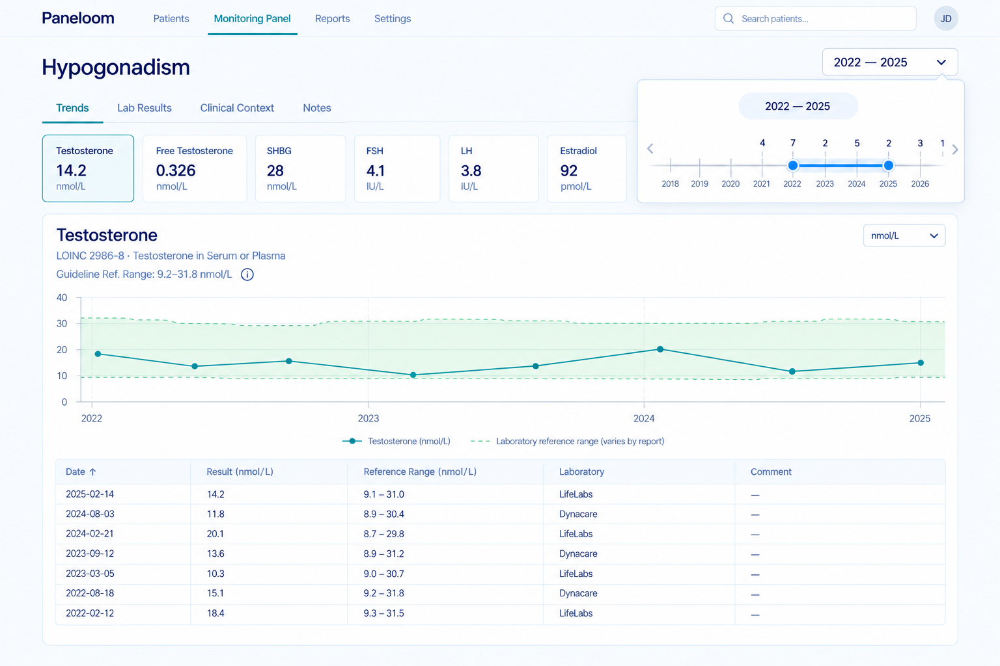

# Build the panel Trends tab (analyte focus, timeline, lab-mapping audit)

Split out of task-0022 on 2026-09-14, since this is an entirely separate,
still-unbuilt UI surface (the Trends tab currently renders as an empty
placeholder, `TrendsView.tsx`) rather than a refinement of the Results table
work task-0022 already shipped.

See task-0022's "Tab purposes" section for how Trends fits alongside the other three tabs, and [ADR-0024](../tech/decisions/adr-0024-panel-date-range-is-header-scoped-and-explicitly-applied.md) for the header-scoped date-range control architecture.

## Trends Tab (Analyte Focus)

The **Trends** tab focuses on individual marker trajectory and data provenance:

### 1. Key Marker Summary Cards (Top)
- Carousel / row of summary cards for the panel's primary markers (e.g. Glucose, Insulin, HOMA-IR, HbA1c).
- Each card shows:
  - Current value & unit
  - Directional delta & percentage change (e.g. `↓ 12%`, `↑ 18%`)
  - Mini sparkline over time
- Clicking any card switches the main trend chart and audit table below to that analyte.

### 2. Interactive Analyte Timeline Chart (Middle)
- **Title & Unit Switcher**: e.g. `Glucose (mmol/L)` with a unit selector dropdown (`mmol/L`, `mg/dL`).
- **Multi-Lab Legend**: Color-coded points and line segments by performing laboratory (e.g. LabCorp, Quest, Invitro, Syntest).
- **Date Range Selector**: Dropdown or slider (e.g. `2021 – 2026`).
- **Tooltip / Hint**:
  - Draw date & performing lab
  - Analytical method (e.g. ECLIA, Hexokinase)
  - Specimen type (e.g. Serum, Plasma)
  - Raw reported value & units vs. normalized value & units
  - Report-specific reference range for that draw date
- **Reference Range Bands**: Shaded area or step-lines showing report-specific reference ranges.

### 3. Lab Name Normalization & Audit ("Table of Matches", Bottom)
- **Mapping Table**:
  - `Printed name (as on report)`
  - `Source` (Lab & language/locale, e.g. `LabCorp (EN)`, `Invitro (RU)`)
  - `Mapped to` (friendly name & LOINC)
  - Method, Specimen, raw value/unit, report range
- **Normalization Badges**:
  - Checkmarks highlighting applied normalizations:
    - *LOINC matched*
    - *Converted units (e.g. mmol/L ↔ mg/dL)*
    - *Multilingual names unified (e.g. EN/RU)*
- Tagline: *"Different labs. Same marker. One timeline."*

Provide full transparency on how raw printed lab data was ingested, matched, and transformed into canonical form:

| Source Report (As Printed) | Mapped & Normalized (Canonical) |
| --- | --- |
| **Date** (sampling date) | **Canonical LOINC** |
| **Lab** (originating facility) | **Friendly Name** |
| **Method** (analytical methodology) | **Normalized Value** |
| **Specimen** (sample matrix) | **Normalized Unit** |
| **Raw LOINC** (if printed on report) | **Canonical Reference Range** |
| **Printed Name** | |
| **Raw Value** | |
| **Raw Unit** | |
| **Report Reference Range** | |

- Highlights mapping confidence or discrepancies (e.g., derived LOINCs, alias matches).
- Allows auditing exact transcription against canonical storage.
