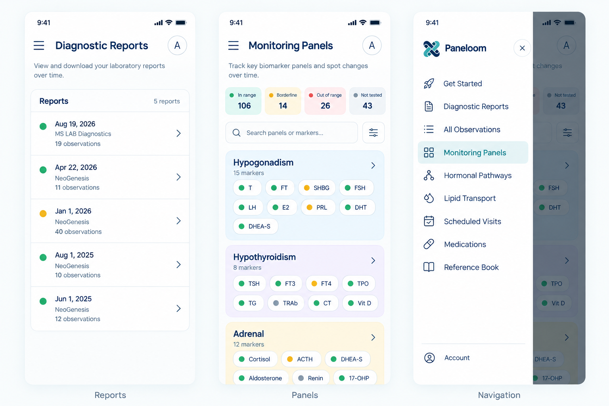

# Design the mobile app shell (nav pattern, layout mockups)

Alex's request: "draw mobile app interface design."

## Why this is a sub-task of task-0020, not a rename of it

[task-0020](task-0020.md) ("Adapt the app shell to phones") already
exists with real content — not a stub. It documents the current state
precisely: below the `768px` breakpoint (`MOBILE_QUERY` in
`useIsMobile.ts`) the app still renders the old wrapping `NavBar.tsx`
unchanged, while desktop/tablet get the newer `AppShell.tsx` (white
`TopBar` + collapsible left `SideNav.tsx` listing all ten sections,
Account included). It states the open question — drawer vs. bottom tab bar,
and where the privacy badge goes — and lists four things any
replacement must preserve: hide-on-scroll, the results-table header
reveal's `--mc-nav-h`/`--mc-nav-offset` contract, nav state (blocked
routes, active-route derivation, keyboard/`aria-current`), and no
remount at the breakpoint.

task-0020 is therefore the **build** task; it deliberately leaves the
nav-pattern question open rather than deciding it inline. This new task
is the **design-first** pass that produces the actual visual artifacts
(mockups/wireframes) needed to close that open question and feed a
build — kept separate because it's a distinct kind of work (visual
design review, not implementation), the same way task-0024 (Hormonal
Pathways) split its ChatGPT-mockup design pass from the build. Filed as
a child of task-0020 (`parent_task: task-0020`) rather than folding
directly into it, so task-0020's own file stays the implementation
record and this one stays the design record — matching how task-0024's
mockups are referenced from, but not merged into, its own build
history.

## Precedent: how task-0024 used mockups

Confirmed by reading [task-0024](task-0024.md) in full. Its process:

- Alex shared a ChatGPT-produced design mockup, then a second, revised
  one from an image prompt drafted in chat and reviewed the same day.
- Both are explicitly scoped as **"a visual style reference only —
  never a source for edges or biology"**: layout/style ideas, not
  ground truth. Both mockups had actual wiring errors that the task
  file calls out and corrects in a dedicated "Biology corrections vs.
  the mockups" section.
- No image is committed to the repo. The task file's prose (plus a
  separate Mermaid wiring spec file) *is* the spec — the mockup is a
  reference the author looked at, not an artifact the codebase ships.
- The task file itself carries a running "Status" note distinguishing
  what the mockup showed vs. what was actually decided/built,
  including an explicit "Superseded by the build" section where
  real decisions departed from the mockup.

This task follows the same pattern: produce mockups as a style/layout
reference for task-0020's build, document them and the decisions they
inform in prose here (not as committed image files), and expect the
build to correct or depart from them where mobile UX constraints (not
covered by a generic AI-generated mockup) demand it.

## Scope

Produce actual visual mockups/wireframes for a phone-width app shell —
navigation chrome and page layout — to replace the current `NavBar.tsx`
fallback, structured the same way task-0024's mockups fed its build:
reviewed, and corrected against the constraints below rather than
taken as-is.

### Open questions this task should surface, not decide

- **Nav pattern.** The desktop `SideNav` lists ten sections (Get
  Started, Diagnostic Reports, All Observations, Monitoring Panels,
  Hormonal Pathways, Lipid Transport, Scheduled Visits, Medications,
  Reference Book, Account — plus whatever `NAV_ITEMS` has grown to by
  build time), Account pinned at the foot. None of the standard phone
  patterns fit ten items cleanly:
  - A bottom tab bar comfortably holds four or five items before
    needing a "More" overflow — which four or five, and what's in
    "More"?
  - A drawer behind a hamburger button preserves all ten without
    picking favorites, but loses the one-tap access a tab bar gives
    the sections used every session (Monitoring Panels, Diagnostic
    Reports).
  - A hybrid (a short bottom bar for the 2-3 heaviest-traffic
    sections, drawer for the rest) is a third option worth mocking.
- **Where the privacy badge goes.** Desktop's `TopBar` shows a lock +
  "Your data stays in this browser" (or the cloud-check "Synced to
  your account" when signed in) — there's no obvious top-bar room for
  it at phone width once the section title and any back/menu control
  take that space.
- **Where `--mc-nav-h`/`--mc-nav-offset` come from** under a bottom-bar
  design — today `NavBar` publishes a top offset; a bottom bar would
  need its own equivalent (or an inverted, bottom-anchored offset) for
  `TableScroller`'s pulled-open date header and "Dates" chip to park
  correctly, and this changes depending on which nav pattern is
  chosen.
- **How hide-on-scroll applies to a bottom bar** — sliding a top nav
  away on scroll-down is established (`useHideOnScroll.ts`); whether a
  bottom tab bar should do the same, or stay pinned (the more common
  mobile convention), is an open call the mockups should show both
  ways of.

None of the above should be decided in this task — mock up at least
two candidate nav patterns (e.g. one bottom-tab-bar variant, one
drawer variant) with enough page-layout detail (section landing page,
a results-table page, a detail page) that task-0020 can pick one with
real visual context instead of choosing blind.

### What must survive (carried over from task-0020, restated so a mockup reviewer doesn't have to cross-reference)

- Hide-on-scroll behavior (or a deliberate, mocked-out alternative for
  a bottom bar).
- A place for the results-table header reveal's offset variables to
  anchor to.
- Nav state: blocked-route styling, active-section highlighting,
  keyboard/`aria-current` accessibility — a mockup should at minimum
  show the blocked and active visual states, not just the happy path.
- No remount at the breakpoint — out of scope for a visual mockup, but
  worth a one-line note in the eventual build handoff so it isn't
  dropped.

## Deliverable

Mockups/wireframes and UX analysis documenting the mobile navigation and screen layouts.

### Visual Reference

*(Image asset: [`docs/assets/mobile-app-shell-design.png`](../assets/mobile-app-shell-design.png), archived in [`docs/brand/designs/ChatGPT Image Sep 18, 2026, 04_32_46 PM.png`](../brand/designs/ChatGPT%20Image%20Sep%2018,%202026,%2004_32_46%20PM.png))*

The mockup explores three screens answering the open questions posed in [task-0020](task-0020.md):

1. **Screen 1 — Diagnostic Reports (Landing & List View)**:
   - **Header**: Hamburger menu icon (left), section title ("Diagnostic Reports"), and Account avatar button "A" (right).
   - **Subheader**: Explanatory subtitle ("View and download your laboratory reports over time").
   - **Section summary**: Header row with "Reports" and count badge ("5 reports").
   - **Report Card List**: Clean card rows showing status dot indicator (green / amber), report date (e.g. `Aug 19, 2026`), laboratory provider (`MS LAB Diagnostics`), observation count (`19 observations`), and chevron navigation affordance (`›`).

2. **Screen 2 — Monitoring Panels (Overview & Status Filtering)**:
   - **Header**: Consistent mobile header (`[≡] Monitoring Panels [A]`).
   - **Status Filter Counters**: 4-column summary KPI grid matching our status semantics:
     - `In range` (Green, e.g. 106)
     - `Borderline` (Yellow/Amber, e.g. 14)
     - `Out of range` (Coral/Red, e.g. 26)
     - `Not tested` (Gray, e.g. 43)
     Tapping each toggles the status filter (matching desktop `MonitoringPanelsView`'s `StatusFilterToggles`).
   - **Filter & Search Bar**: Integrated search input ("Search panels or markers...") with filter toggle button.
   - **Panel Cards / Groups**: Vertical stack of panels (Hypogonadism, Hypothyroidism, Adrenal) showing marker count and pill chips for each analyte with status dots (`● T`, `● FT`, `● SHBG`, etc.), with tap-through to Panel Detail view.

3. **Screen 3 — Slide-out Navigation Drawer**:
   - **Header**: Brand mark + wordmark (`Paneloom`) with close button (`✕`).
   - **Section List**: Resolves the 10-section conundrum without awkward "More" overflow menus:
     - 🚀 Get Started
     - 📄 Diagnostic Reports
     - 📋 All Observations
     - 🪟 Monitoring Panels (active state with soft highlighted pill background)
     - 🧬 Hormonal Pathways
     - 💧 Lipid Transport
     - 📅 Scheduled Visits
     - 💊 Medications
     - 📖 Reference Book
   - **Footer**: Pinned `Account` section at the bottom with avatar / user icon.
   - **Backdrop**: Semi-transparent scrim over the darkened page underneath.

---

### UX Corrections & Refinements vs. the Mockup

Like the desktop and pathway mockups, the AI-drawn mockup serves as a visual layout reference rather than rigid specification. The following requirements from `task-0020` and the codebase must be observed during the build:

1. **Privacy Badge & Top Bar Space**:
   - The mockup puts the Account avatar `[A]` in the top right. In `TopBar.tsx`, the privacy badge ("Your data stays in this browser" / "Synced to your account") is a core trust promise.
   - *Refinement*: On phones, the top bar can show `[≡]` (menu) on the left and the privacy lock icon (tapping it opens the privacy explanation modal or tooltip) next to the Account avatar or within the slide-out drawer header.
2. **Scroll Contract (`--mc-nav-h` / `--mc-nav-offset`)**:
   - Because this uses a top header + slide-out drawer (rather than a bottom tab bar), `--mc-nav-h` maps cleanly to the mobile top header height (~56px).
   - `useHideOnScroll.ts` will slide the top header up on scroll-down and reveal on scroll-up, seamlessly updating `--mc-nav-offset` so `TableScroller` sticky headers and "Dates" chips continue to park perfectly.
3. **No Remount at 768px Breakpoint**:
   - `AppShell.tsx` will house the drawer alongside the desktop sidebar, conditionally toggling between `SideNav` (pinned desktop sidebar) and `Drawer` (slide-over modal) based on `useIsMobile`, preserving component identity and page state across viewport resizes and orientation flips.
4. **Blocked State & Active Indication**:
   - When diagnostic reports have validation errors, `isNavItemBlocked` disables blocked sections in the drawer with muted styling and warning tooltip.

