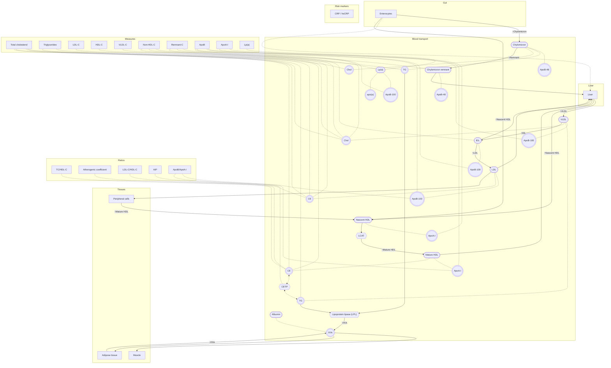

# Add a Lipid transport pathway diagram

A second pathway beside the gonadal axis ([task-0024](task-0024.md)): how
fat and cholesterol travel from the gut and the liver through the blood to the
tissues, drawn as lipoprotein particles with the user's own lipid panel placed
on them. It reuses the [pathway](../product/concepts/pathway.md) ontology and
[ADR-0014](../tech/decisions/adr-0014-pathway-wiring-is-mermaid-generated-to-json.md)'s
notation; where lipid transport does not fit either, this spec says so rather
than bending the biology. Worked out from Alex's sketches, reviewed and
corrected in chat.

Nothing here may ship uncited: every flow, every note and every reference
range below needs a retrieved source first ([Open questions](#open-questions),
3). The "Source" column is the to-do list for that.

## Ontology, reused

- **Roles, not chemistry.** A lipoprotein particle is a **carrier** — like
  SHBG, it holds what it transports; its cargo is drawn **docked** on it, the
  way SHBG-bound T is. Lipases and transfer proteins are **enzymes** on the
  path they act on. Fatty acids are a signal-like molecule, docked on albumin.
- **Zones**, captioned as on the gonadal axis: **Gut** (enterocytes),
  **Liver**, **Blood transport** (the lipoprotein particles), **Tissues**
  (muscle, adipose tissue, peripheral cells).
- **Glyph size by level of organisation, never by particle diameter**: every
  particle, apolipoprotein, cargo chip, enzyme, albumin and fatty acid 32px;
  cells and tissues (enterocytes, muscle, adipose, peripheral cells) 64px;
  organs (liver) 128px. A chylomicron is physically far larger than an HDL, and
  the drawing deliberately does not say so.
- **Chips**: each particle carries its **apolipoprotein chip** (its identity —
  one ApoB per ApoB particle) and its **cargo chips** (TRIG and Chol, see
  [Particle glyph](#particle-glyph)), each with a status dot when a measured or
  computed value lands on it.
- **Arrows** uncolored, effect marked **↑B / ↓B** on the target end, dashed for
  exchange and crosstalk; thickness and grey-when-unmeasured as on the gonadal
  axis. Where an arrow acts (organ → tissue → cell → receptor, e.g. LDLR on
  peripheral cells) is sidecar data shown on hover, not drawing.
- **Badges** in a column on the right, association lines hidden at rest,
  drawn on hover, focus or open; text single-sourced from `INDEX_DEFS` where
  an index exists.

### Particle glyph

Settled with Alex on 2026-09-16.

- **One outlined particle shape per lipoprotein**, labelled with the particle's
  name (e.g. HDL), containing its **structural apoprotein as the holder node**,
  with **two docked cargo chips**:
  - **TRIG** — triglycerides;
  - **Chol** — total cholesterol, free plus esterified, which is what a lab's
    LDL-C and HDL-C measure in the particle.
- **Phospholipids are not drawn.**
- **Holders**:

  | Particle | Holder |
  | --- | --- |
  | Chylomicron, chylomicron remnant | ApoB-48 |
  | VLDL, IDL, LDL | ApoB-100 |
  | Lp(a) | ApoB-100 + apo(a) |
  | HDL (nascent and mature) | ApoA-I |

- **A diagram abstraction, not anatomy.** In a real particle the core is
  triglycerides and cholesteryl esters, the shell phospholipids, free
  cholesterol and apoproteins, and the apoprotein does not "hold" the cargo.
  The full five-part composition — phospholipids, free cholesterol, cholesteryl
  esters, triglycerides, apoprotein — goes in the particle's expanded card and
  hover text.
- **Proportions differ widely**: chylomicron ~85–90% TG, VLDL ~50–60%, LDL
  ~5–10%, HDL ~5% and mostly protein and phospholipid around a
  cholesteryl-ester core made by LCAT. Whether chip size reflects proportion is
  open ([Open questions](#open-questions), 4), and the figures need a retrieved
  source before they appear anywhere.
- **Exchangeable apolipoproteins appear only on the flows they drive**, never
  as chips: ApoC-II activating LPL, ApoC-III inhibiting it, ApoE for hepatic
  uptake of remnants and IDL.

The Mermaid sketch, [Values](#values) and [Badges](#badges) predate this
glyph: their "cholesterol" and "CE" chips are the particle's Chol chip, and
their "TG" chips its TRIG chip.

## Nodes

| Zone | Node | Kind | Chips |
| --- | --- | --- | --- |
| Gut | Enterocytes | cell (64px) | — |
| Liver | Liver | organ (128px) | — |
| Blood transport | Chylomicron | carrier | ApoB-48; TRIG, Chol |
| Blood transport | Chylomicron remnant | carrier | ApoB-48; TRIG, Chol |
| Blood transport | VLDL | carrier | ApoB-100; TRIG, Chol |
| Blood transport | IDL | carrier | ApoB-100; TRIG, Chol |
| Blood transport | LDL | carrier | ApoB-100; TRIG, Chol |
| Blood transport | Lp(a) | carrier | ApoB-100 **plus apo(a)** — an LDL-like particle; **not ApoA**; TRIG, Chol |
| Blood transport | Nascent HDL | carrier | ApoA-I; TRIG, Chol |
| Blood transport | Mature HDL | carrier | ApoA-I; TRIG, Chol |
| Blood transport | Albumin | carrier | free fatty acids (docked) |
| Blood transport / Tissues | Lipoprotein lipase (LPL) | enzyme | — (hover: capillary endothelium of muscle and adipose tissue) |
| Blood transport | CETP | enzyme, **optional** | — |
| Blood transport | LCAT | enzyme, **optional** | — |
| Tissues | Muscle, Adipose tissue, Peripheral cells | cell / tissue (64px) | — |

## Flows

| # | Flow | Mark | Notes | Source |
| --- | --- | --- | --- | --- |
| F1 | Enterocytes → Chylomicron | ↑Chylomicron | inside the enterocyte, absorbed long-chain fatty acids and monoglycerides are re-esterified into TG and packed with ApoB-48 and cholesterol; secreted **into lymph** (lacteals → thoracic duct), so it **bypasses the liver at first** | to retrieve |
| F1b | Enterocytes → portal blood (albumin-bound) → Liver | — | **optional thin path**: short- and medium-chain fatty acids (under ~12 carbons) skip chylomicrons and go straight to the liver | to retrieve |
| F2 | Chylomicron TG → LPL → free fatty acids | ↑FFA | lipolysis at the capillary wall; part of the released fatty acids spills over into blood on albumin | to retrieve |
| F2b | Adipose tissue → free fatty acids (albumin-bound) | ↑FFA | **the main source** of albumin-bound fatty acids in systemic blood: adipose lipolysis between meals, plus LPL spillover (F2, F8) | to retrieve |
| F3 | Free fatty acids → Muscle | — | energy | to retrieve |
| F4 | Free fatty acids → Adipose tissue | — | storage | to retrieve |
| F5 | Chylomicron → Chylomicron remnant | ↑Remnant | as its TG is removed | to retrieve |
| F6 | Chylomicron remnant → Liver | — | hepatic uptake | to retrieve |
| F7 | Liver → VLDL | ↑VLDL | hepatic TG and cholesterol | to retrieve |
| F8 | VLDL TG → LPL → free fatty acids | ↑FFA | same enzyme as F2 | to retrieve |
| F9 | VLDL → IDL → LDL | ↑IDL, ↑LDL | the cascade as TG is removed; whether hepatic lipase is drawn on IDL → LDL is for source review | to retrieve |
| F10 | IDL → Liver | — | **part** of IDL is cleared | to retrieve |
| F11 | LDL → Peripheral cells | — | via the LDL receptor; membranes, steroid hormones | to retrieve |
| F12 | LDL → Liver | — | **most** LDL is cleared by the liver | to retrieve |
| F13 | Liver (and gut) → Nascent HDL | ↑Nascent HDL | ApoA-I | to retrieve |
| F14 | Peripheral cells → Nascent HDL → Mature HDL | ↑Mature HDL | HDL takes up cells' cholesterol; LCAT esterifies it (optional node) | to retrieve |
| F15 | Mature HDL → Liver | — | reverse cholesterol transport | to retrieve |
| F16 | HDL cholesterol esters ⇄ VLDL/LDL triglycerides, via CETP | dashed ⇄ | **optional**; explains why high TG goes with low HDL-C | to retrieve |

**Fatty acids are never attached to chylomicrons in blood**: a chylomicron
carries TG, and what LPL frees from it leaves the particle — into the tissue or
onto albumin — so no FFA chip docks on any particle.

**Deliberately out**: vitamin D. It is not fed by LDL — skin makes it from
7-dehydrocholesterol — so no LDL → vitamin D arrow, and no vitamin D node.

## Mermaid sketch

In ADR-0014's style: one top-level subgraph per zone, node shape the kind,
`-.-` for docking and association, quoted ↑B labels. It is a sketch for review,
not yet valid under ADR-0014's restricted subset ([below](#fit-with-adr-0014s-subset)).

### Fit with ADR-0014's subset

The sketch needs constructs the subset rejects today, which is the
"axis whose wiring the subset cannot express" ADR-0014 names as a reason to
revisit:

- **Carriers on pathway arrows** — particles remodel into each other (CM →
  remnant, VLDL → IDL → LDL, nascent → mature HDL); the subset gives a carrier
  no arrows at all.
- **Organs, cells and tissues as arrow endpoints** (Enterocytes, Liver,
  Muscle, Adipose, Peripheral cells); the subset allows a cell only as a label
  folded onto one arrow.
- **Unlabelled uptake arrows** (into the liver or a tissue): nothing named
  rises, so there is no ↑B to write.
- **Structural chips** (apolipoproteins) docked beside cargo, and **one enzyme
  fed by two substrates** (LPL from chylomicron and VLDL TG).
- **A dashed exchange through an enzyme** (CETP), where the subset's `<-->`
  joins only a signal and its docked form.
- **A dashed arrow that is neither feedback nor crosstalk** — the optional
  portal path F1b — and a Mermaid `%%` comment, which the generator would have
  to ignore.
- **A third badge group**, `RISK`, beside the reserved `MEASURES` and
  `RATIOS`.

## Values

Checked against `web/public/data/analyses.json`, `panels.json` and
`monitoring-panels.json` (Cardiovascular Risk = `lipid-metabolism` +
`cardiovascular-inflammatory`) on 2026-09-16. Readings fold through
`ALIAS_TO_PRIMARY` as everywhere else.

| Value | Catalog LOINC (alias) | In Cardiovascular Risk | Placed on |
| --- | --- | --- | --- |
| Total cholesterol | `2093-3` (`14647-2` mmol/L) | yes | every cholesterol / CE chip |
| LDL-C | `13457-7`, by calculation (`22748-8` mmol/L) | yes | LDL CE chip |
| HDL-C | `2085-9` (`14646-4` mmol/L) | yes | mature HDL CE chip |
| Triglycerides | `2571-8` (`14927-8` mmol/L) | yes | chylomicron and VLDL TG chips |
| VLDL-C | `13458-5` (`25371-6` mmol/L) | **no** — catalog only | VLDL cholesterol chip |
| ApoB | `1884-6` | yes | every ApoB-100 chip (VLDL, IDL, LDL, Lp(a)) |
| ApoA-I | `1869-7` | yes | nascent and mature HDL ApoA-I chips |
| Lp(a) | `10835-7` (mass) | yes | Lp(a) particle |
| TC/HDL-C (printed) | `9830-1` | yes | ratio badge, twin of `tchdl` |
| CRP / hsCRP | `1988-5` / `30522-7` | yes | **risk badge only**, no transport lines |

**Missing from the catalog**: direct LDL-C (`18262-6`); measured non-HDL-C
(`43396-1`, today only the `nonhdl` index's code); Lp(a) in nmol/L (molar
code to verify on retrieval) — and never folded into the mg/dL code, since
apo(a) isoform size makes mass ↔ molar unconvertible (a claim to cite); ApoB-48
(no routine assay). oxLDL (`54238-1`) and the panel's other inflammatory and
thrombotic markers are in the panel but not transport, so not drawn for now.

## Badges

Every key verified in `web/src/data/indexDefs.ts`; each links to what it reads.

| Badge | Index key | Association lines to |
| --- | --- | --- |
| LDL-C (Friedewald / Sampson / Martin-Hopkins) | `ldlf`, `ldls`, `ldlmh` | LDL CE chip; VLDL TG and cholesterol chips (the VLDL-C estimate each subtracts) |
| VLDL-C | `vldl` | VLDL cholesterol chip, VLDL TG chip |
| Non-HDL-C | `nonhdl` | cholesterol of every ApoB particle |
| Remnant-C | `remnant` | VLDL, IDL and chylomicron-remnant cholesterol |
| TC/HDL-C | `tchdl` | every cholesterol chip, HDL CE chip |
| Atherogenic coefficient | `ka` | every non-HDL cholesterol chip, HDL CE chip |
| LDL-C/HDL-C | `ldlhdl` | LDL CE chip, HDL CE chip |
| AIP | `aip` | TG chips, HDL CE chip, CETP |
| ApoB/ApoA-I | `apobapoa` | ApoB-100 chips, ApoA-I chips |

**No TG/HDL index exists** (`tyg` is TyG, Insulin Resistance only); AIP is its
log₁₀ in molar units. A plain TG/HDL badge would be a new index, its own task.
A printed value and its computed twin (LDL-C `13457-7` vs `ldlf`, TC/HDL-C
`9830-1` vs `tchdl`) follow [task-0038](task-0038.md).

## Notes (hover text, each cited)

- **Serum triglycerides are the total across all lipoproteins**: fasting,
  mostly VLDL; non-fasting, chylomicrons add to it. The TG badge therefore
  links to both, and the app records no fasting state to say which dominates.
- **Friedewald's TG/5 is the VLDL-C assumption** — the `vldl` index and the
  term `ldlf` subtracts; Martin-Hopkins replaces the fixed 5 with its table.
- **Lp(a) is LDL-like**: ApoB-100 with apo(a) attached; its ApoB counts in
  the ApoB badge.
- The diagram is sex-independent; a sex-banded range follows `bandsBySex` and
  Database details' `sex` as elsewhere.
- **Reference ranges**: the lab's printed range when the reading has one, else
  a curated, cited range as `pathway-reference-ranges.json` does it. Lipid
  guidance is largely a treatment target by risk category rather than a
  population range, and Lp(a) thresholds come from the retrieved consensus,
  never from memory.

## Open questions

1. **Section naming and nav.** The nav item is "Hormonal Pathways" and lipid
   transport is not hormonal. Either rename it **"Pathways"** with an axis
   selector (the `#pathways/<axis>` tabs task-0024 planned: `hpg`, later
   `hpt`, `hpa`, and `lipids`), or give lipid transport its own nav item.
2. **ADR-0014 pipeline or hand-coded.** Wait for the Mermaid →
   `pathways.json` pipeline (not built yet) and extend its subset for the
   constructs [above](#fit-with-adr-0014s-subset), or hand-code the wiring in a
   view like the gonadal axis and migrate later.
3. **Sources.** None retrieved yet, and nothing ships uncited. Candidates:
   Feingold KR, "Introduction to Lipids and Lipoproteins", Endotext (flows);
   the 2019 ESC/EAS dyslipidaemia guideline (targets, non-HDL-C, ApoB); the
   2022 EAS Lp(a) consensus statement (Lp(a) thresholds, mass vs molar). Each
   flow, note and range takes a retrieved quote, URL and retrieval date, in the
   style of `indexDefs.ts`' references.
4. **Chip size by proportion.** Whether a particle's TRIG and Chol chips scale
   with their share of its mass ([Particle glyph](#particle-glyph)), or stay a
   fixed 32px like every other glyph.
   For the particle row on the Lipid Transport page, settled below
   ([Prototype](#prototype)); still open for the full transport diagram.
5. **Verify the ESC/EAS 2019 ApoB recommendation** (Class I, Level C: "ApoB
   analysis is recommended for risk assessment, particularly in people with high
   TG, DM, obesity or metabolic syndrome, or very low LDL-C") against the
   primary PDF before citing it; the 2018 AHA/ACC guideline's ApoB ≥ 130 mg/dL
   as a risk-enhancing factor needs the same check. Neither is cited on the
   page yet: the ApoB chip and badge cite Sniderman et al. 2019 (JAMA
   Cardiology) only.
6. **IDL and Lp(a) mass composition.** Neither retrieved source prints it, so
   Data mode draws both empty; a source that does would fill them.
7. **The HMG-CoA → mevalonate step.** The liver card names HMG-CoA reductase's
   role but not the reaction; it needs a retrieved source before it is shown.
8. **The liver glyph.** Resolved 2026-09-16: `LiverIcon`, a blocky 32 × 27
   outline that read coarse at 128px, was replaced on this page by
   `web/public/pathways/liver.png`, ChatGPT-generated artwork by Alex
   (illustrative, ADR-0022); the Fatty Liver panel card keeps `LiverIcon`.

## Outcome

Done: the page shipped and was then redrawn as a holder-plus-cargo diagram
([task-0062](task-0062.md)); what it looks like today is documented in
[`../tech/pathway-pages.md`](../tech/pathway-pages.md#lipid-transport). The
prototype notes below describe the first version and are kept as history.

**Follow-up, not a new task**: the Mermaid → `pathways.json` pipeline
([ADR-0014](../tech/decisions/adr-0014-pathway-wiring-is-mermaid-generated-to-json.md),
open question 2 — the wiring is still hand-coded in the view) and the renamed
"Pathways" section with axis tabs (open question 1); the HMG-CoA → mevalonate
step still awaits a source (open question 7).

## Prototype

Built 2026-09-16 as its own nav section, **Lipid Transport** (`#lipids`, right
after Hormonal Pathways, blocked while reports have errors), answering open
question 1 for now with a separate page rather than a renamed "Pathways".

- **Particle row**, in transport order: Chylomicron, VLDL, IDL, LDL, Lp(a), HDL.
  **Outline size follows diameter order in fixed steps, not scale**
  (170 / 142 / 118 / 100 / 100 / 72 px) — here, unlike the 32px rule above,
  since the row exists to show the particles side by side.
- **Two glyph modes**, switched by an unpersisted "Particles" control:
  - **Artwork** (default) — ChatGPT-generated SVGs supplied by Alex, text and
    background stripped; their TRIG and Chol areas are **approximate and
    illustrative**, which the page states.
  - **Data** — drawn by the app: **fill areas are the midpoint of the sourced
    mass shares**, an unsourced share is left empty and the particle says
    "composition not sourced" (IDL, Lp(a)).
- **Data**: `web/public/data/lipoprotein-particles.json` with a closed schema,
  every figure as its source printed it — diameter, density and structural
  apoproteins from Feingold, Endotext "Introduction to Lipids and Lipoproteins"
  Table 1 (NBK305896); TG, cholesterol, phospholipid and protein percentages
  from Cox & García-Palmieri, Clinical Methods Table 31.2 (NBK351), with
  StatPearls for chylomicron protein (~2%, where Table 31.2's 9% makes its row
  107%) and LDL (20% protein, 50% cholesterol, against Table 31.2's 26%).
  Not sourced: IDL and Lp(a) mass composition.
- **Values**: chips under the particles (VLDL-C, LDL-C, Lp(a), HDL-C, ApoA-I,
  and one ApoB chip under a bracket spanning VLDL to Lp(a)) and a badge column
  (Total cholesterol, merged LDL-C, Triglycerides, ApoB, Non-HDL-C, Remnant-C,
  TC/HDL-C, LDL-C/HDL-C, AIP, ApoB/ApoA) whose association lines ring the
  compound region each reads — Chol, TRIG or the apoprotein pill.
- **Liver**: an organ node (128px) above VLDL with **HMG-CoA reductase** docked
  on it (32px, the shared enzyme artwork) and a pale secretion arrow down to
  VLDL. Its card cites Feingold (Endotext: "Introduction to Lipids and
  Lipoproteins", "Cholesterol Lowering Drugs") for "rate-limiting enzyme in
  cholesterol synthesis" and for statins inhibiting it; the HMG-CoA →
  mevalonate step is **pending a source** and is not shown until one is
  retrieved. The liver is `liver.png`, illustrative artwork at 128px wide
  (question 8, resolved).
- **Shared with Hormonal Pathways**: measures, reference and source blocks,
  the date stepper, dismissal, association rings and lines, the
  layout-measuring hook, `SIZE`, the enzyme artwork and the raster `Glyph` come
  from `pathwayShared.ts` and `PathwayParts.tsx`
  ([ADR-0021](../tech/decisions/adr-0021-pathway-pages-share-one-overlay-engine.md));
  the two glyph modes follow
  [ADR-0022](../tech/decisions/adr-0022-illustrative-artwork-and-data-drawn-glyphs-coexist.md).
- **Tests**: `lipoprotein-particles.json` against its schema and for internal
  consistency, the glyph region areas, and the artwork's tagging in
  `reference-data.test.ts` and `lipid-artwork.test.ts`; `#lipids` routing and
  blocking in `routing.test.ts`; `pathway-views.test.tsx` renders the view in
  jsdom over synthetic results (particles, badges, the illustrative note, grey
  dashes with no data, the date stepper, the SI/US switch, Artwork/Data modes
  and "composition not sourced" for IDL and Lp(a), the LDL-C badge's
  Martin-Hopkins fallback, a badge's reference range and Escape), and
  `pathway-shared.test.ts` the shared pure helpers. The association geometry,
  which needs real layout, is not tested.

**Not built** from the spec above: the Gut and Tissues zones (enterocytes,
muscle, adipose, peripheral cells), the chylomicron remnant and nascent HDL,
albumin with free fatty acids, LPL, CETP and LCAT, every flow except the liver
→ VLDL arrow (F1–F16, none cited yet), exchangeable-apolipoprotein marks, the
Atherogenic coefficient (`ka`) and CRP badges, curated lipid reference ranges
(chips show the lab's range or "No reference range"), a Mermaid source or
`pathways.json` (open question 2; the wiring is hand-coded in the view), and
the renamed "Pathways" section with axis tabs (open question 1).
